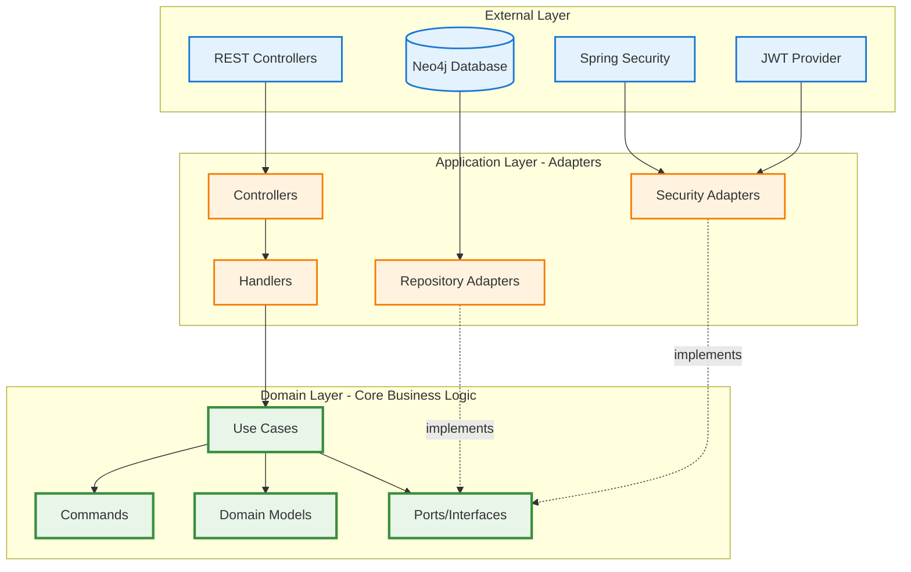
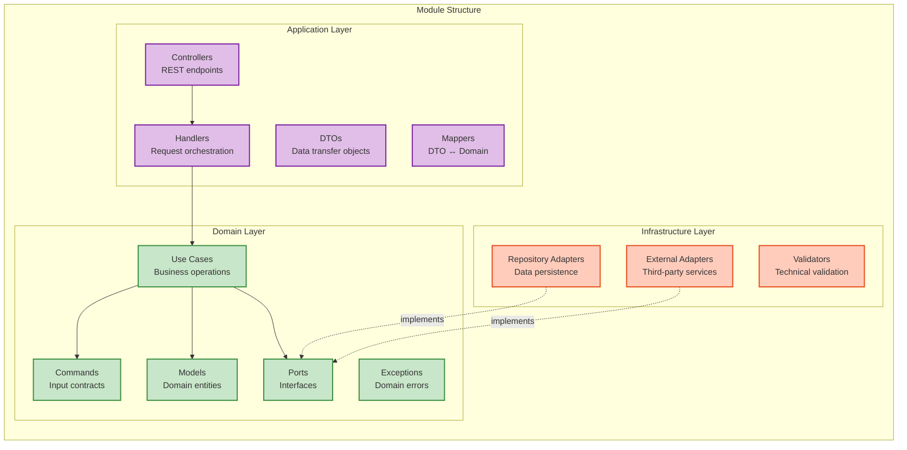
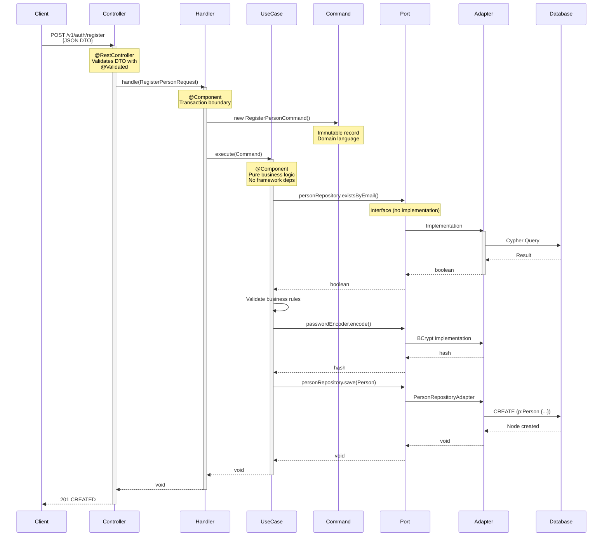
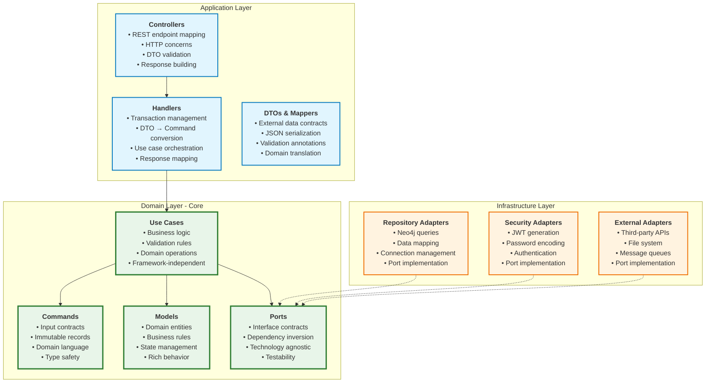
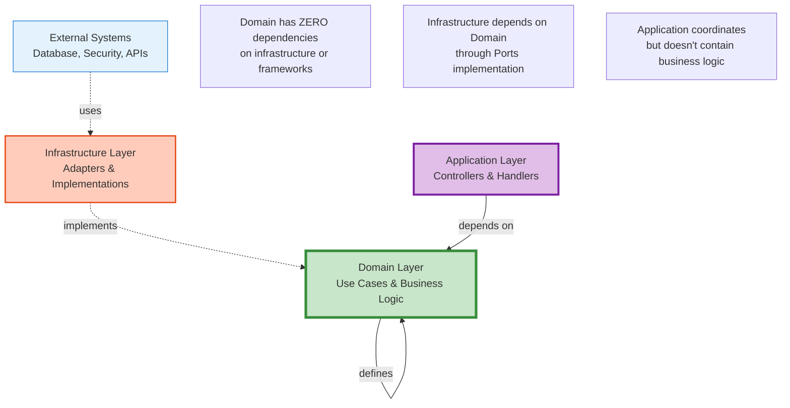
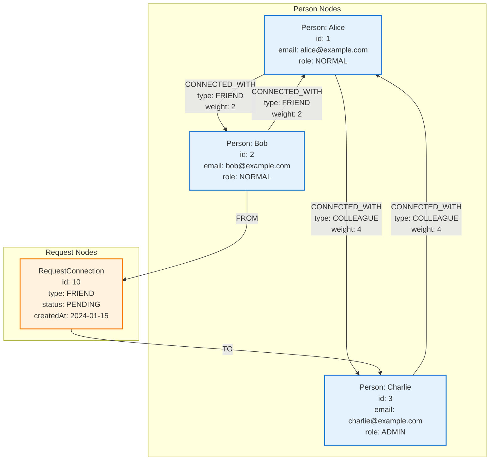

# Vinculo

> Enterprise-grade graph-based social network platform leveraging Neo4j for high-performance relationship management

[](https://www.oracle.com/java/)
[](https://spring.io/projects/spring-boot)
[](https://neo4j.com/)
[](https://opensource.org/licenses/MIT)

## 📑 Table of Contents

- [Overview](#-overview)
- [Features](#-features)
- [Technology Stack](#-technology-stack)
- [Architecture](#-architecture)
  - [Hexagonal Architecture Overview](#hexagonal-architecture-overview)
  - [DDD Module Structure](#ddd-module-structure)
  - [Request Flow](#request-flow-controller--handler--use-case--command)
  - [Layer Responsibilities](#layer-responsibilities)
  - [Dependency Flow](#dependency-flow)
- [Prerequisites](#-prerequisites)
- [Getting Started](#-getting-started)
- [API Documentation](#-api-documentation)
- [Database Schema](#-database-schema)
- [Security](#-security)
- [Development](#-development)
- [Contributing](#-contributing)

## 🎯 Overview

**Vinculo** (Portuguese for "bond" or "connection") is a production-ready social networking platform architected using modern software engineering principles. Built on Spring Boot 4.0 and Neo4j 5, this application demonstrates professional implementation of Clean Architecture, Domain-Driven Design, and graph database technology for managing complex social relationships at scale.

### Core Capabilities

Vinculo provides a complete social networking solution with:
- **User Profile Management**: Full CRUD operations for user accounts with role-based access control
- **Connection System**: Bidirectional relationship management with nine distinct connection types and weighted importance
- **Request Workflow**: State-managed connection request lifecycle (pending, accepted, rejected)
- **Content Publishing**: User-generated posts with visibility controls and feed aggregation
- **Network Visualization**: Interactive graph visualization of social networks and connections
- **Secure Authentication**: Stateless JWT-based authentication with BCrypt password encryption

### Technical Motivation

Traditional relational databases require expensive JOIN operations to traverse relationships, resulting in performance degradation as social graphs grow. Neo4j's native graph storage model treats relationships as first-class citizens, enabling:
- **Constant-time relationship traversals** regardless of network size
- **Natural modeling** of complex interconnected data
- **Efficient pattern matching** for social network queries
- **Real-time graph analytics** without performance penalties

This architecture makes Vinculo capable of scaling to millions of users while maintaining sub-millisecond query performance for connection-based operations.

## ✨ Features

### Authentication & Authorization
- **User Registration & Login**: Secure account creation with comprehensive validation
- **JWT Authentication**: Stateless token-based authentication with configurable expiration
- **Role-Based Access Control (RBAC)**: Granular permissions with ADMIN and NORMAL roles
- **Password Security**: Industry-standard BCrypt hashing with automatic salt generation
- **Method-Level Security**: Spring Security annotations for fine-grained authorization

### User Profile Management
- **CRUD Operations**: Complete lifecycle management for user profiles
- **Data Validation**: Email format validation and international phone number verification (E.164)
- **Administrative Controls**: Admin-only operations for system management
- **Pagination Support**: Efficient data retrieval with configurable page size and offset

### Connection Management System
- **Connection Requests**: Initiate connections with other users through formal request workflow
- **Request Lifecycle**: State-managed workflow (PENDING → ACCEPTED/REJECTED)
- **Nine Connection Categories**:
  - **Tier 1** (Weight 1): PARTNER, FAMILY
  - **Tier 2** (Weight 2): FRIEND, BUSINESS_PARTNER
  - **Tier 3** (Weight 3): MENTOR, REFERRAL
  - **Tier 4** (Weight 4): COLLEAGUE, BUDDY
  - **Tier 5** (Weight 5): ACQUAINTANCE
- **Bidirectional Relationships**: Symmetric connection graph when requests are accepted
- **Weighted Importance**: Relationship strength indicators for network analysis

### Content Publishing
- **Post Creation**: User-generated text content with timestamp tracking
- **Personal Feed**: Aggregated view of posts from connected users
- **Profile Posts**: Browse content by specific user
- **Access Control**: Users can only delete their own content
- **Pagination**: Efficient content loading with skip/limit parameters

### Network Visualization
- **Personal Network Graph**: Visual representation of your social connections
- **Any User Network**: View the network structure of any user in the system
- **Graph Data Export**: Nodes and edges in structured format for visualization libraries
- **Real-time Accuracy**: Direct queries against Neo4j graph for current network state

### Connection Request State Machine
```
PENDING → User sends request
    ↓
ACCEPTED → Bidirectional CONNECTED_WITH relationship created (both users linked)
    ↓
    Active Connection
    
PENDING → User sends request
    ↓
REJECTED → Request marked as rejected (no connection created)
```

## 🛠️ Technology Stack

### Core Framework & Runtime
- **Spring Boot 4.0.2**: Enterprise application framework with auto-configuration
- **Java 21**: Latest LTS version with virtual threads and pattern matching
- **Maven**: Dependency management and build automation

### Database & Persistence
- **Neo4j 5**: Native graph database for relationship-centric data
- **Spring Data Neo4j**: Object-graph mapping and repository abstraction
- **Cypher**: Declarative graph query language

### Security & Authentication
- **Spring Security**: Comprehensive authentication and authorization framework
- **JWT (JSON Web Tokens)**: Stateless authentication with HMAC-SHA256 signing
- **BCrypt**: Adaptive password hashing algorithm
- **OAuth2 Resource Server**: Standards-based token validation

### API & Documentation
- **SpringDoc OpenAPI 3.0**: Automated API documentation generation
- **Swagger UI**: Interactive API exploration and testing interface
- **Jakarta Bean Validation**: Declarative input validation

### Infrastructure & Deployment
- **Docker**: Application containerization
- **Docker Compose**: Multi-container orchestration
- **Dockerfile**: Multi-stage build optimization

### Additional Libraries
- **Lombok**: Boilerplate code reduction through annotations
- **libphonenumber (Google)**: International phone number validation (E.164 format)
- **JJWT**: Java JWT library for token creation and parsing

### Development & Testing
- **JUnit 5**: Unit testing framework
- **Spring Boot Test**: Integration testing support
- **Testcontainers**: Container-based integration tests (Neo4j)
- **MockMvc**: HTTP endpoint testing

## 🏗️ Architecture

Vinculo implements **Clean Architecture** principles through **Hexagonal Architecture** (Ports and Adapters pattern) combined with **Domain-Driven Design (DDD)** modular organization. This architectural approach ensures:

- **Business Logic Independence**: Core domain remains framework-agnostic and testable
- **Dependency Inversion**: All dependencies point inward toward the domain layer
- **Technology Flexibility**: Infrastructure components are pluggable and replaceable
- **Testability**: Business logic can be tested without external dependencies
- **Maintainability**: Clear separation of concerns enables independent evolution of layers

### Hexagonal Architecture Overview

The application follows a layered architecture where dependencies flow unidirectionally inward. External frameworks and infrastructure are isolated from business logic through well-defined interfaces (ports), allowing the core domain to remain independent and testable.



### DDD Module Structure

Each business capability is encapsulated as an independent, cohesive module following Domain-Driven Design principles. This modular approach enables:



### Project Module Organization

```
src/main/java/com/vinculo/
├── module/                      # Business domain modules
│   ├── auth/                    # Authentication & authorization
│   │   ├── application/         # REST API layer (controllers, DTOs, handlers)
│   │   │   ├── controller/      # HTTP endpoints (AuthController)
│   │   │   ├── dto/             # Data transfer objects (LoginRequest, RegisterPersonRequest)
│   │   │   └── handler/         # Request orchestration (LoginHandler, RegisterPersonHandler)
│   │   ├── domain/              # Core business logic
│   │   │   ├── command/         # Input contracts (LoginCommand, RegisterPersonCommand)
│   │   │   ├── port/            # Abstractions (AuthenticatorPort, TokenProvider)
│   │   │   └── use_case/        # Business operations (LoginUseCase, RegisterPersonUseCase)
│   │   └── infrastructure/      # Technical implementations
│   │       └── security/        # JWT provider, Spring Security adapters
│   │
│   ├── person/                  # User profile management
│   │   ├── controller/          # API layer
│   │   │   ├── controller/      # PersonController (CRUD endpoints)
│   │   │   ├── dto/             # Request/Response DTOs
│   │   │   ├── handler/         # Business operation handlers
│   │   │   └── mapper/          # DTO ↔ Domain model mapping
│   │   ├── domain/              # Person business logic
│   │   │   ├── command/         # Person commands
│   │   │   ├── exception/       # Domain-specific exceptions
│   │   │   ├── model/           # Person entity, RoleUser enum
│   │   │   ├── port/            # Repository, Encoder, Validator interfaces
│   │   │   └── use_case/        # CRUD operations
│   │   └── infrastructure/      # Technical adapters
│   │       ├── encoder/         # BCrypt password encoder adapter
│   │       ├── persistence/     # Neo4j repository implementation
│   │       └── validator/       # Phone number validation adapter
│   │
│   ├── connection/              # Connection management
│   │   ├── application/         # REST API layer
│   │   ├── domain/              # Connection business logic, type definitions
│   │   └── infrastructure/      # Neo4j relationship persistence
│   │
│   ├── request_connection/      # Connection request workflow
│   │   ├── application/         # Request handling API
│   │   ├── domain/              # State machine, workflow strategies
│   │   └── infrastructure/      # Request persistence
│   │
│   ├── post/                    # Content publishing
│   │   ├── application/         # API layer (controller, DTOs, handlers, mappers)
│   │   ├── domain/              # Post business logic (use cases, model, ports, policies)
│   │   └── infrastructure/      # Neo4j post persistence
│   │
│   └── graph/                   # Network visualization
│       ├── application/         # Graph API endpoints
│       │   ├── controller/      # GraphController
│       │   ├── dto/             # GraphResponse, NodeResponse, EdgeResponse
│       │   ├── handler/         # GetGraphNetworkHandler
│       │   └── mapper/          # Graph data transformation
│       ├── domain/              # Graph domain logic
│       │   ├── model/           # GraphNetwork, Node, Edge
│       │   ├── port/            # GraphRepository interface
│       │   ├── query/           # GetGraphNetworkQuery
│       │   └── use_case/        # GetGraphNetworkUseCase
│       └── infrastructure/      # Cypher graph queries
│           └── persistence/     # GraphRepositoryAdapter
│
└── share/                       # Cross-cutting concerns
    ├── config/                  # OpenAPI configuration
    ├── exception/               # Global exception handling
    ├── security/                # Security configuration, filters
    └── service/                 # Shared services (AuthenticationService)
```

### Request Flow: Controller → Handler → Use Case → Command

Every API request follows a standardized flow through architectural layers, ensuring consistent processing and clear separation of concerns:



### Layer Responsibilities



### Dependency Flow

The architecture enforces strict dependency rules - dependencies always point inward toward the domain:



### Key Architectural Patterns

This application implements industry-standard design patterns to ensure maintainability, testability, and scalability:

- **Hexagonal Architecture (Ports and Adapters)**: Isolates business logic from infrastructure concerns through well-defined interfaces
- **Domain-Driven Design**: Organizes code by business capabilities rather than technical layers
- **Command Pattern**: Encapsulates use case inputs as immutable records with domain-specific language
- **Repository Pattern**: Abstracts data access behind interfaces, enabling technology-independent business logic
- **Strategy Pattern**: Implements polymorphic behavior for connection request status handling
- **DTO Pattern**: Separates external API contracts from internal domain models
- **Handler Pattern**: Manages transaction boundaries and orchestrates cross-cutting concerns
- **Dependency Injection**: Enables loose coupling and simplifies testing through constructor injection
- **Mapper Pattern**: Translates between DTOs and domain entities while preserving layer boundaries

## 📋 Prerequisites

- **Java 21** or higher
- **Maven 3.9+**
- **Docker** and **Docker Compose** (for containerized deployment)
- **Neo4j 5** (if running without Docker)

## 🚀 Getting Started

### Option 1: Docker Compose (Recommended for Production)

The containerized deployment provides a complete, isolated environment with both the application and Neo4j database.

1. **Clone the repository**:
```bash
git clone https://github.com/Luca5Eckert/vinculo.git
cd vinculo
```

2. **Configure environment variables** in `.env`:
```env
# Neo4j Database Configuration
NEO4J_USER=neo4j
NEO4J_PASSWORD=your_secure_password_here
NEO4J_URI=bolt://neo4j:7687

# Application Configuration
APP_PORT=8080

# Security Configuration (IMPORTANT: Use a strong 256+ bit key in production)
JWT_KEY=your_jwt_secret_key_minimum_256_bits_recommended_to_use_base64_encoded_random_bytes
```

3. **Launch the application stack**:
```bash
docker-compose up -d
```

4. **Verify deployment**:
- Application API: `http://localhost:8080`
- Neo4j Browser: `http://localhost:7474`
- Swagger UI: `http://localhost:8080/swagger-ui/index.html`

5. **Monitor logs**:
```bash
docker-compose logs -f vinculo  # Application logs
docker-compose logs -f neo4j    # Database logs
```

### Option 2: Local Development Environment

For development and debugging, run the application directly on your local machine.

1. **Install and configure Neo4j**:
```bash
# Option A: Using Docker
docker run -d \
  --name neo4j \
  -p 7474:7474 \
  -p 7687:7687 \
  -e NEO4J_AUTH=neo4j/your_secure_password \
  neo4j:5-community

# Option B: Download and install from https://neo4j.com/download/
```

2. **Set environment variables**:
```bash
export SPRING_NEO4J_URI=bolt://localhost:7687
export SPRING_NEO4J_AUTHENTICATION_USERNAME=neo4j
export SPRING_NEO4J_AUTHENTICATION_PASSWORD=your_secure_password
export JWT_KEY=your_jwt_secret_key_minimum_256_bits
```

3. **Build the project**:
```bash
./mvnw clean package -DskipTests
```

4. **Run the application**:
```bash
./mvnw spring-boot:run
```

### Verify Installation

Test the API health with a simple authentication attempt:

```bash
# Expected response: 401 Unauthorized (server is running and responding)
curl -s -o /dev/null -w "%{http_code}\n" \
  -X POST http://localhost:8080/v1/auth/login \
  -H "Content-Type: application/json" \
  -d '{"email":"nonexistent@example.com","password":"test"}'
```

### First Steps

1. **Register a user account**:
```bash
curl -X POST http://localhost:8080/v1/auth/register \
  -H "Content-Type: application/json" \
  -d '{
    "name": "John Doe",
    "email": "john.doe@example.com",
    "password": "SecurePassword123!",
    "phoneNumber": "+15555551234"
  }'
```

2. **Obtain authentication token**:
```bash
curl -X POST http://localhost:8080/v1/auth/login \
  -H "Content-Type: application/json" \
  -d '{
    "email": "john.doe@example.com",
    "password": "SecurePassword123!"
  }'
```

3. **Use the token for authenticated requests**:
```bash
TOKEN="<your-jwt-token-here>"
curl -X GET http://localhost:8080/v1/persons/me \
  -H "Authorization: Bearer $TOKEN"
```

## 📚 API Documentation

### Interactive Documentation

Vinculo provides comprehensive API documentation through OpenAPI 3.0 (Swagger). Access the interactive documentation once the application is running:

- **Swagger UI** (Interactive Testing): `http://localhost:8080/swagger-ui/index.html`
- **OpenAPI Specification** (JSON): `http://localhost:8080/v3/api-docs`
- **OpenAPI Specification** (YAML): `http://localhost:8080/v3/api-docs.yaml`

#### Using Swagger UI for Authenticated Endpoints

1. Click the **"Authorize"** button in the top-right corner
2. Enter your JWT token in the format: `Bearer {your-token}`
3. Click **"Authorize"** to save the credentials
4. All subsequent requests will include the authentication header

### API Base URL

```
http://localhost:8080/v1
```

All endpoints are prefixed with `/v1` for API versioning.

#### Register User
```http
POST /v1/auth/register
Content-Type: application/json

{
  "name": "John Doe",
  "email": "john.doe@example.com",
  "password": "SecurePassword123!",
  "phoneNumber": "+15555551234"
}
```

**Response:** `201 Created`
```json
{
  "id": 1,
  "name": "John Doe",
  "email": "john.doe@example.com",
  "phoneNumber": "+15555551234",
  "role": "NORMAL"
}
```

#### Login
```http
POST /v1/auth/login
Content-Type: application/json

{
  "email": "john.doe@example.com",
  "password": "SecurePassword123!"
}
```

**Response:** `200 OK`
```json
{
  "token": "eyJhbGciOiJIUzI1NiIsInR5cCI6IkpXVCJ9.eyJzdWIiOiJqb2huLmRvZUBleGFtcGxlLmNvbSIsInVzZXJfaWQiOjEsInJvbGVzIjpbIk5PUk1BTCJdLCJpYXQiOjE3MDk5MTQ4MDB9.signature"
}
```

### Person Management Endpoints

**Note:** All endpoints require `Authorization: Bearer {token}` header.

#### Get All Persons
```http
GET /v1/persons?page=0&size=10
Authorization: Bearer {token}
```

#### Get Person by ID
```http
GET /v1/persons/{personId}
Authorization: Bearer {token}
```

#### Update Person Profile
```http
PUT /v1/persons/{personId}
Authorization: Bearer {token}
Content-Type: application/json

{
  "name": "John Updated Doe",
  "phoneNumber": "+15555559999"
}
```

**Response:** `200 OK` with updated person object

#### Delete Person (Admin Only)
```http
DELETE /v1/persons/{personId}
Authorization: Bearer {token}
```

**Response:** `204 No Content`

### Connection Request Endpoints

#### Send Connection Request
```http
POST /v1/request-connections/{targetPersonId}
Authorization: Bearer {token}
Content-Type: application/json

{
  "type": "FRIEND"
}
```

**Connection Types:**
- `PARTNER`, `FAMILY` (Tier 1, Weight 1)
- `FRIEND`, `BUSINESS_PARTNER` (Tier 2, Weight 2)
- `MENTOR`, `REFERRAL` (Tier 3, Weight 3)
- `COLLEAGUE`, `BUDDY` (Tier 4, Weight 4)
- `ACQUAINTANCE` (Tier 5, Weight 5)

**Response:** `201 Created` with request details

#### Accept or Reject Connection Request
```http
PUT /v1/request-connections/{requestId}
Authorization: Bearer {token}
Content-Type: application/json

{
  "status": "ACCEPTED"
}
```

**Status Values:** `ACCEPTED`, `REJECTED`

**Response:** `200 OK`
- When `ACCEPTED`: Creates bidirectional `CONNECTED_WITH` relationship
- When `REJECTED`: Updates request status without creating connection

#### Get My Connection Requests
```http
GET /v1/request-connections/me
Authorization: Bearer {token}
```

**Response:** `200 OK` with both incoming and outgoing connection requests

### Connection Management Endpoints

#### Get My Active Connections
```http
GET /v1/connections/me
Authorization: Bearer {token}
```

**Response:** `200 OK` with all established connections (accepted requests only)

### Post Publishing Endpoints

#### Create Post
```http
POST /v1/posts
Authorization: Bearer {token}
Content-Type: application/json

{
  "content": "Hello, Vinculo! Excited to connect with everyone."
}
```

**Response:** `201 Created`
```json
{
  "id": 42,
  "content": "Hello, Vinculo! Excited to connect with everyone.",
  "createdAt": "2024-03-15T14:30:00",
  "authorId": 1
}
```

#### Get Personal Feed
```http
GET /v1/posts?skip=0&limit=20
Authorization: Bearer {token}
```

**Query Parameters:**
- `skip` (optional): Number of posts to skip for pagination (default: 0)
- `limit` (optional): Maximum posts to return (default: 10, max: 100)

**Response:** `200 OK` with posts from your connections

#### Get Posts by Specific User
```http
GET /v1/posts/{authorId}?skip=0&limit=20
Authorization: Bearer {token}
```

**Response:** `200 OK` with posts published by the specified user

#### Delete Post
```http
DELETE /v1/posts/{postId}
Authorization: Bearer {token}
```

**Response:** `204 No Content`

**Authorization:** Only the post author can delete their own posts

### Network Graph Visualization Endpoints

#### Get My Network Graph
```http
GET /v1/graphs/me
Authorization: Bearer {token}
```

**Response:** `200 OK`
```json
{
  "nodes": [
    {
      "id": "1",
      "name": "John Doe",
      "email": "john.doe@example.com"
    },
    {
      "id": "2",
      "name": "Jane Smith",
      "email": "jane.smith@example.com"
    }
  ],
  "edges": [
    {
      "source": "1",
      "target": "2",
      "type": "FRIEND",
      "weight": 2
    }
  ]
}
```

**Description:** Returns the complete social network graph for the authenticated user, including all direct connections.

#### Get Network Graph for Any User
```http
GET /v1/graphs/{personId}
Authorization: Bearer {token}
```

**Response:** `200 OK` with graph data structure (same format as above)

**Description:** Visualize the social network of any user in the system. Useful for network analysis and relationship visualization.

**Use Cases:**
- Social network visualization in frontend applications
- Graph analytics and pattern detection
- Connection degree analysis
- Network topology exploration

## 🗂️ Database Schema

### Neo4j Graph Data Model

Vinculo's data model leverages Neo4j's native graph structure for efficient relationship traversal and natural modeling of social connections.

#### Node Types

**Person Node**
```cypher
(:Person {
  id: Long,              // Unique identifier
  name: String,          // Full name
  email: String,         // Email address (unique constraint)
  password: String,      // BCrypt hashed password
  phoneNumber: String,   // E.164 formatted international phone number
  role: String           // User role: "ADMIN" or "NORMAL"
})
```

**RequestConnection Node**
```cypher
(:RequestConnection {
  id: Long,              // Unique identifier
  type: String,          // Connection type (FRIEND, FAMILY, etc.)
  status: String,        // Request status: "PENDING", "ACCEPTED", or "REJECTED"
  createdAt: DateTime    // Timestamp of request creation
})
```

**Post Node**
```cypher
(:Post {
  id: Long,              // Unique identifier
  content: String,       // Post content/text
  createdAt: DateTime    // Publication timestamp
})
```

#### Relationship Types

**Connection Request Flow**
```cypher
(:Person)-[:FROM]->(:RequestConnection)-[:TO]->(:Person)
```
Represents a connection request from one person to another. The intermediate `RequestConnection` node stores metadata about the request.

**Established Connection** (Created when request is accepted)
```cypher
(:Person)-[:CONNECTED_WITH {type: String, weight: Integer}]->(:Person)
```
Bidirectional relationship created when a connection request is accepted. Both persons have this relationship pointing to each other.

**Post Authorship**
```cypher
(:Person)-[:AUTHORED]->(:Post)
```
Links a person to posts they have created.

### Connection Type Taxonomy

Vinculo categorizes connections into nine types with associated weights, enabling relationship-aware queries and network analysis.

| Connection Type | Weight | Tier | Semantic Meaning |
|----------------|--------|------|------------------|
| PARTNER | 1 | 1 | Life partner or romantic relationship |
| FAMILY | 1 | 1 | Family member (immediate or extended) |
| FRIEND | 2 | 2 | Close personal friend |
| BUSINESS_PARTNER | 2 | 2 | Business partner or co-founder |
| MENTOR | 3 | 3 | Mentor or mentee relationship |
| REFERRAL | 3 | 3 | Professional referral or recommendation |
| COLLEAGUE | 4 | 4 | Work colleague or team member |
| BUDDY | 4 | 4 | Casual friend or acquaintance with shared interests |
| ACQUAINTANCE | 5 | 5 | Loose connection or someone met briefly |

**Weight Semantics:** Lower weight values indicate closer, more significant relationships. This enables:
- Prioritization of feed content from closer connections
- Social graph algorithms (influence calculation, recommendation engines)
- Privacy controls based on relationship strength
- Network distance calculations

### Graph Database Visual Model



## 🔒 Security

Vinculo implements defense-in-depth security principles with multiple layers of protection.

### Authentication Architecture

**JWT (JSON Web Tokens)**
- **Algorithm**: HMAC-SHA256 (HS256)
- **Token Expiration**: 1 hour (configurable via application properties)
- **Claims Structure**:
  - `sub` (Subject): User email address
  - `user_id`: Person identifier for quick lookups
  - `roles`: Array of user roles for authorization
  - `iat` (Issued At): Token generation timestamp
  - `exp` (Expiration): Token expiration timestamp
- **Stateless Design**: No server-side session storage required, enabling horizontal scalability

### Password Security

**BCrypt Adaptive Hashing**
- **Algorithm**: BCrypt with automatic salt generation
- **Work Factor**: Default strength (configurable, typically 10-12 rounds)
- **Salt**: Unique per password, stored in hash output
- **Future-Proof**: Work factor can be increased as computational power grows

### Authorization Model

**Role-Based Access Control (RBAC)**

| Role | Permissions |
|------|-------------|
| `NORMAL` | - Manage own profile<br>- Create/manage connections<br>- Publish and view posts<br>- View network graphs |
| `ADMIN` | - All NORMAL permissions<br>- Delete any user account<br>- System-wide user management |

**Implementation Mechanisms:**
- `@PreAuthorize` annotations on controller methods
- Spring Security expression language for complex rules
- Resource ownership validation in service layer

### Security Controls Implemented

✅ **Authentication & Session Management**
- Stateless JWT authentication
- Secure password hashing (BCrypt)
- Token expiration handling
- Protected endpoints with bearer token validation

✅ **Input Validation**
- Jakarta Bean Validation on all DTOs
- Email format validation (RFC 5322)
- Phone number validation (E.164 format via libphonenumber)
- SQL/Cypher injection prevention through parameterized queries

✅ **Authorization**
- Role-based access control
- Resource ownership verification
- Method-level security annotations

✅ **Data Protection**
- Passwords never stored in plaintext
- Sensitive data excluded from logs
- Environment-based configuration for secrets

✅ **API Security**
- CORS configuration
- HTTP security headers
- Content-Type validation

### Production Security Recommendations

⚠️ **Critical for Production Deployment:**

**Transport Security**
- Enable HTTPS/TLS for all communications
- Use valid SSL/TLS certificates (Let's Encrypt, commercial CA)
- Enforce HSTS (HTTP Strict Transport Security)
- Disable HTTP fallback

**Secret Management**
- Use dedicated secrets management (HashiCorp Vault, AWS Secrets Manager, Azure Key Vault)
- **Never commit** `.env` files or secrets to version control
- Generate strong JWT secret keys (256+ bits, base64-encoded random bytes)
- Rotate secrets regularly (JWT keys, database passwords)

**Rate Limiting & DoS Prevention**
- Implement API rate limiting (Spring Cloud Gateway, nginx)
- Configure request throttling per user/IP
- Set maximum request size limits
- Enable connection pooling with limits

**CORS Configuration**
- Restrict allowed origins to specific domains (not `*`)
- Limit allowed HTTP methods
- Configure allowed headers explicitly
- Enable credentials only when necessary

**Monitoring & Auditing**
- Implement comprehensive logging (authentication attempts, authorization failures)
- Set up security event monitoring and alerting
- Log security-relevant events without exposing sensitive data
- Regular security audit log reviews

**Dependency Management**
- Keep all dependencies up to date
- Regular security scanning (OWASP Dependency-Check, Snyk)
- Subscribe to security advisories for frameworks and libraries
- Automated dependency updates with testing

**Database Security**
- Use separate credentials for application vs. administrative access
- Enable Neo4j authentication and encryption
- Regular database backups with encryption at rest
- Network isolation (private subnets, firewall rules)
- Principle of least privilege for database access

**Additional Hardening**
- Disable unnecessary endpoints and features
- Implement security headers (CSP, X-Frame-Options, X-Content-Type-Options)
- Enable request/response sanitization
- Regular penetration testing and security audits

## 🧪 Development

### Build & Package

**Clean Build**
```bash
./mvnw clean install
```

**Package without Tests** (faster for development iterations)
```bash
./mvnw clean package -DskipTests
```

**Create Executable JAR**
```bash
./mvnw clean package
# Output: target/vinculo-0.0.1-SNAPSHOT.jar
```

### Testing

**Run All Tests**
```bash
./mvnw test
```

**Run Specific Test Class**
```bash
./mvnw test -Dtest=LoginUseCaseTest
```

**Run Tests with Coverage** (if configured)
```bash
./mvnw clean verify
```

**Test Categories:**
- **Unit Tests**: Domain logic testing in isolation (use cases, commands)
- **Integration Tests**: Module integration testing with test containers
- **API Tests**: HTTP endpoint testing with MockMvc

### Running the Application

**Development Mode** (with auto-restart)
```bash
./mvnw spring-boot:run
```

**With Custom Profile**
```bash
./mvnw spring-boot:run -Dspring-boot.run.profiles=dev
```

**Debug Mode** (with remote debugging on port 5005)
```bash
./mvnw spring-boot:run -Dspring-boot.run.jvmArguments="-Xdebug -Xrunjdwp:transport=dt_socket,server=y,suspend=n,address=5005"
```

### Code Quality

**Code Style**
- Follow Java naming conventions (PascalCase for classes, camelCase for methods/variables)
- Use Lombok annotations to reduce boilerplate (`@Data`, `@Builder`, `@AllArgsConstructor`)
- Maximum line length: 120 characters
- Use meaningful variable and method names

**Architecture Principles**
- Maintain strict layer separation (domain, application, infrastructure)
- Dependencies flow inward (toward domain layer)
- Use immutable records for commands and DTOs
- Keep use cases focused on single responsibilities
- Write comprehensive exception handling

**Testing Standards**
- Aim for high test coverage on domain layer (>80%)
- Use meaningful test names describing scenarios
- Follow AAA pattern (Arrange, Act, Assert)
- Mock external dependencies, test behavior not implementation
- Write integration tests for critical paths

### Project Structure Best Practices

**Adding New Features:**
1. Create domain model and use cases first (test-driven)
2. Define port interfaces for external dependencies
3. Implement application layer (controllers, handlers, DTOs)
4. Add infrastructure adapters last
5. Document new endpoints in Swagger annotations
6. Write integration tests

**Module Independence:**
- Each module should be independently deployable conceptually
- Avoid circular dependencies between modules
- Share code through `share/` package only when truly cross-cutting
- Prefer duplication over inappropriate coupling

## 🤝 Contributing

Contributions are welcome and appreciated! This project follows standard open-source contribution practices.

### Getting Started

1. **Fork the repository** on GitHub
2. **Clone your fork** locally:
```bash
git clone https://github.com/your-username/vinculo.git
cd vinculo
```
3. **Create a feature branch**:
```bash
git checkout -b feature/descriptive-feature-name
```

### Development Workflow

1. **Make your changes** following the architecture patterns in the codebase
2. **Write tests** for new functionality (unit tests and integration tests as appropriate)
3. **Ensure all tests pass**:
```bash
./mvnw test
```
4. **Commit your changes** with clear, descriptive messages:
```bash
git commit -m "feat: add connection recommendation algorithm"
git commit -m "fix: resolve authentication token expiration issue"
git commit -m "docs: update API documentation for graph endpoints"
```
5. **Push to your fork**:
```bash
git push origin feature/descriptive-feature-name
```
6. **Open a Pull Request** on GitHub with:
   - Clear description of changes and motivation
   - Reference to any related issues
   - Screenshots for UI changes (if applicable)
   - Test coverage information

### Contribution Guidelines

**Code Quality Standards**
- Follow existing architectural patterns (Hexagonal, DDD)
- Maintain layer separation and dependency rules
- Write clean, self-documenting code with meaningful names
- Use Java 21 features appropriately
- Follow existing code style and conventions

**Testing Requirements**
- Add unit tests for business logic (domain layer)
- Add integration tests for critical workflows
- Ensure existing tests continue to pass
- Aim for >80% coverage on new code

**Documentation**
- Update README.md for new features or API changes
- Add JavaDoc comments for public APIs and complex logic
- Include Swagger/OpenAPI annotations on new endpoints
- Update architecture diagrams if adding new modules

**Commit Message Format**
Use conventional commits format:
- `feat:` New feature
- `fix:` Bug fix
- `docs:` Documentation changes
- `refactor:` Code refactoring without behavior change
- `test:` Adding or updating tests
- `chore:` Build process or auxiliary tool changes

**Pull Request Process**
1. Ensure your PR addresses a single concern
2. Keep changes focused and minimal
3. Provide clear description and context
4. Be responsive to review feedback
5. Update documentation and tests as needed

### Code of Conduct

- Be respectful and professional in all interactions
- Welcome newcomers and help them get started
- Provide constructive feedback in code reviews
- Focus on code quality and technical merit
- Report unacceptable behavior to maintainers

### Areas for Contribution

**Feature Enhancements:**
- Connection recommendation engine
- Advanced search capabilities
- Real-time notifications
- Content moderation tools
- Analytics dashboard

**Technical Improvements:**
- Performance optimization
- Additional test coverage
- Security enhancements
- API versioning strategy
- Caching layer implementation

**Documentation:**
- Tutorial videos or blog posts
- API client examples in various languages
- Deployment guides for different platforms
- Architecture decision records (ADRs)

### Questions?

- Open an issue for bug reports or feature requests
- Use discussions for questions and general feedback
- Check existing issues before creating new ones

## 📝 License

This project is licensed under the **MIT License** - see the [LICENSE](LICENSE) file for complete details.

The MIT License is a permissive open-source license that allows:
- ✅ Commercial use
- ✅ Modification
- ✅ Distribution
- ✅ Private use

With minimal restrictions:
- ⚠️ Must include copyright notice and license text
- ⚠️ No liability or warranty provided

## 👨‍💻 Author

**Luca Eckert**
- GitHub: [@Luca5Eckert](https://github.com/Luca5Eckert)
- Project: [Vinculo](https://github.com/Luca5Eckert/vinculo)

This project represents a professional implementation of modern software architecture patterns, demonstrating expertise in:
- Clean Architecture and Hexagonal Architecture (Ports & Adapters)
- Domain-Driven Design (DDD)
- Graph Database Technology (Neo4j)
- Spring Boot Enterprise Development
- RESTful API Design
- Security Best Practices (JWT, BCrypt, RBAC)

## 🙏 Acknowledgments

This project leverages exceptional open-source technologies and frameworks:

- **[Spring Framework](https://spring.io/)** - Comprehensive infrastructure support for enterprise Java applications
- **[Neo4j](https://neo4j.com/)** - Leading graph database platform enabling natural relationship modeling
- **[Project Lombok](https://projectlombok.org/)** - Reducing Java boilerplate through compile-time code generation
- **[SpringDoc OpenAPI](https://springdoc.org/)** - Automated OpenAPI documentation generation
- **[JJWT](https://github.com/jwtk/jjwt)** - Robust JWT implementation for Java

Special recognition to the vibrant open-source community whose collective efforts make projects like this possible.

## 🔗 Additional Resources

**Documentation & Learning**
- [Neo4j Cypher Query Language](https://neo4j.com/docs/cypher-manual/current/)
- [Spring Security Architecture](https://spring.io/guides/topicals/spring-security-architecture)
- [Hexagonal Architecture Guide](https://alistair.cockburn.us/hexagonal-architecture/)
- [Domain-Driven Design](https://martinfowler.com/bliki/DomainDrivenDesign.html)

**Related Projects**
- [Spring Data Neo4j](https://spring.io/projects/spring-data-neo4j)
- [Neo4j Graph Data Science](https://neo4j.com/product/graph-data-science/)

---

<div align="center">

**Built with ❤️ using Spring Boot 4.0 and Neo4j 5**

*Demonstrating enterprise-grade graph-based social networking architecture*

[](https://www.oracle.com/java/)
[](https://spring.io/projects/spring-boot)
[](https://neo4j.com/)
[](https://opensource.org/licenses/MIT)

</div>
