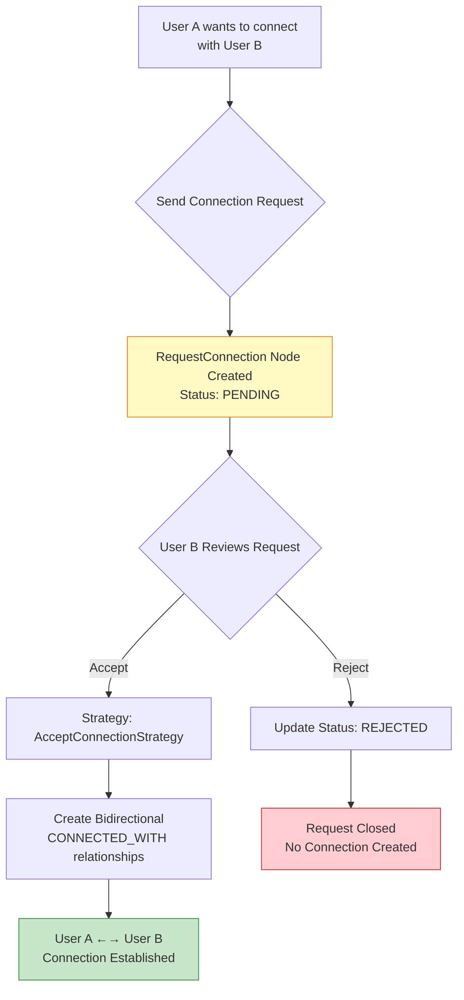
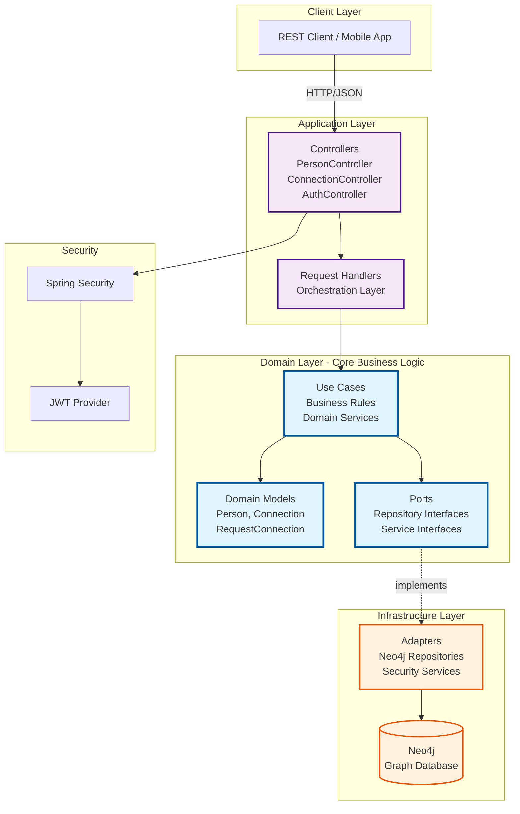
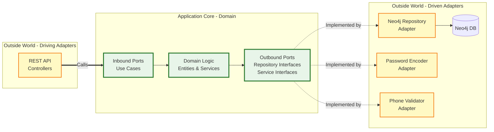
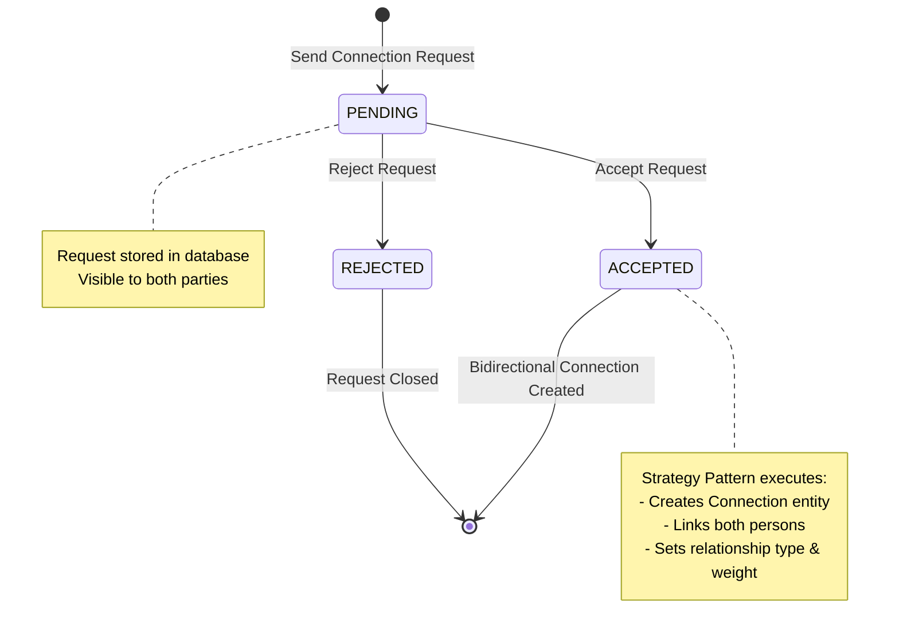
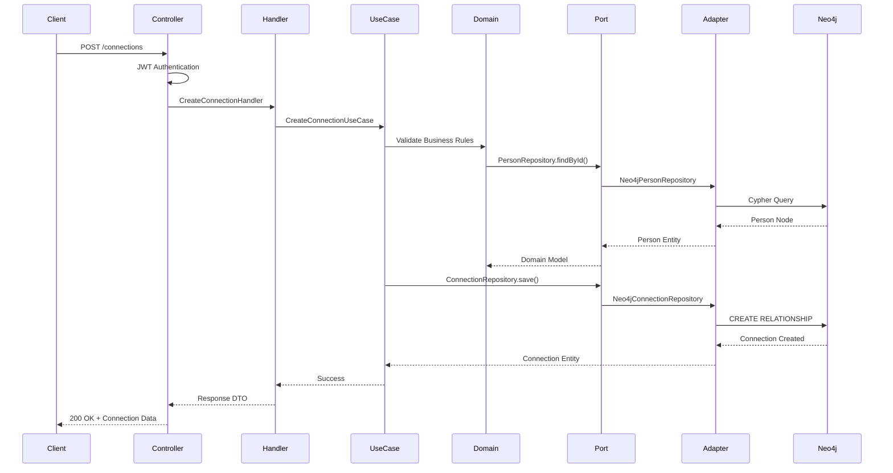
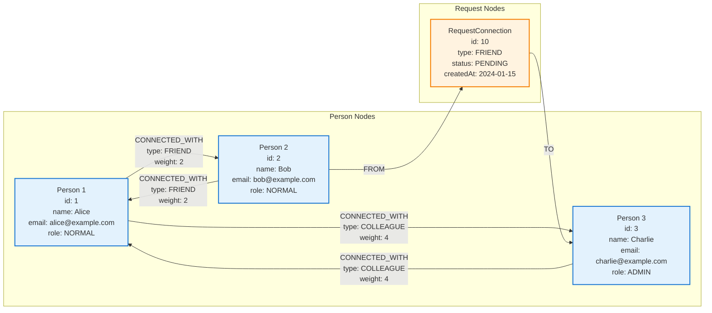
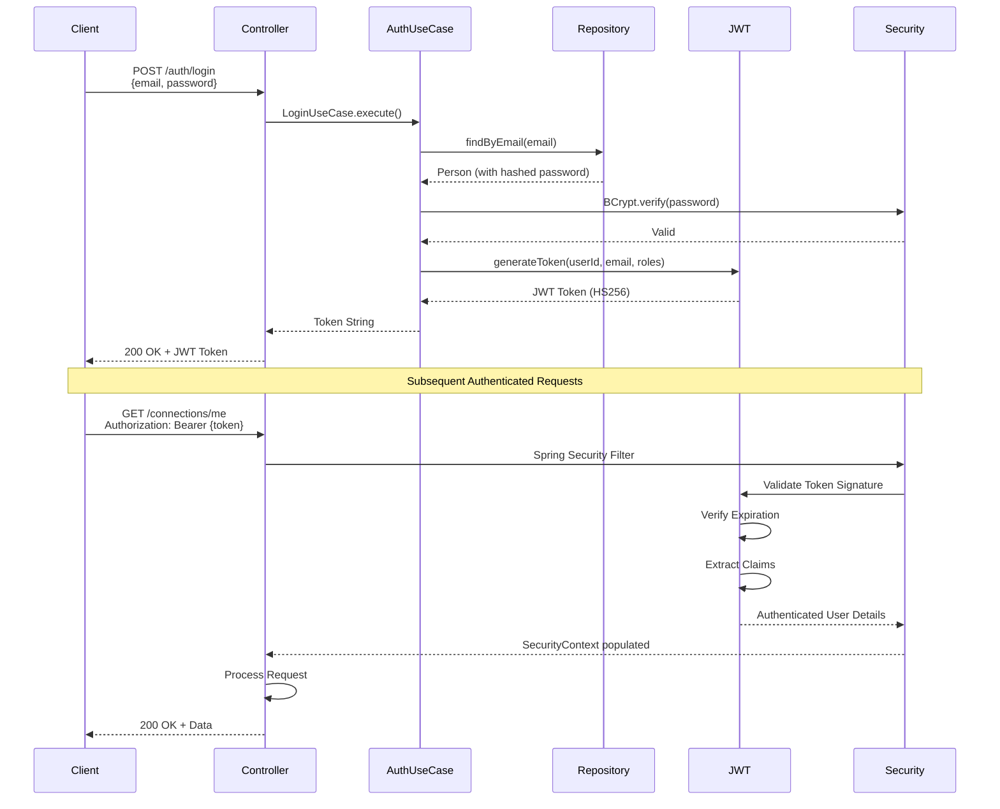

# Vinculo

> **A sophisticated graph-based social network platform for visualizing and managing personal and professional relationships**

[](https://www.oracle.com/java/)
[](https://spring.io/projects/spring-boot)
[](https://neo4j.com/)
[](LICENSE)

## 🎯 Overview

**Vinculo** (Portuguese for "bond" or "connection") is an **enterprise-grade social network platform** engineered to transform abstract relationships into a quantifiable, visual graph structure. Built on graph database technology and hexagonal architecture, Vinculo provides deep insights into personal and professional networks through native relationship modeling.

### Core Value Proposition

In modern networked organizations, understanding relationship dynamics is critical for:
- **Strategic Networking**: Visualize and optimize professional connections
- **Social Capital Management**: Quantify relationship strength through weighted connections
- **Network Analysis**: Discover hidden connections and influential nodes
- **Relationship Intelligence**: Leverage graph algorithms for insights (shortest paths, centrality, community detection)

### Technical Excellence

Vinculo distinguishes itself through:

1. **Graph-Native Design**: Neo4j database optimized for relationship queries
2. **Hexagonal Architecture**: Clean separation enabling enterprise maintainability
3. **Type-Safe Domain**: Strongly-typed relationships with business semantics
4. **Production-Ready Security**: JWT authentication, BCrypt hashing, RBAC
5. **API-First Approach**: RESTful design supporting mobile and web clients

### Vision

Transform social networking from a flat list of contacts into a **rich, interconnected graph** where users can:

- **Visualize network topology** through interactive graph rendering
- **Categorize relationships** with semantic meaning (family, business, mentor)
- **Analyze network structure** using graph theory (degrees of separation, clustering)
- **Understand relationship dynamics** through weighted connection types
- **Discover opportunities** through second-degree connections and path finding

## ✨ Key Features

### 🔐 Secure Authentication
- **JWT-based authentication** for secure API access
- **Role-based access control** (RBAC) with ADMIN and NORMAL user roles
- **Spring Security integration** for enterprise-grade security
- **Password encryption** using BCrypt

### 👥 Person Management
- Comprehensive user profile management
- Email and phone number validation
- Profile update capabilities
- Admin-level user deletion

### 🌐 Connection System

Vinculo implements a **two-phase connection workflow** combining request management with direct connections:

#### Phase 1: Connection Request System

A **formal invitation mechanism** allowing users to initiate relationships:

- **Request Creation**: Users send typed connection requests (FRIEND, COLLEAGUE, etc.)
- **State Management**: Requests tracked through lifecycle (PENDING → ACCEPTED/REJECTED)
- **Bidirectional Visibility**: Both requester and target can view request status
- **Strategy Pattern**: Polymorphic handling of request status changes

**Request States**:
```
PENDING     → Initial state after sending request
ACCEPTED    → Creates bidirectional Connection
REJECTED    → Request closed, no connection created
```

**Use Cases**:
- `SendRequestConnectionUseCase`: Create new connection request
- `UpdateStatusRequestConnectionUseCase`: Accept/reject requests
- `GetMyRequestConnectionsUseCase`: View incoming/outgoing requests

#### Phase 2: Direct Connections

After acceptance, **bidirectional relationships** are created with metadata:

- **Multiple relationship types** with weighted importance:
  - **Tier 1 (Closest)**: Partner, Family
  - **Tier 2 (Close)**: Friend, Business Partner
  - **Tier 3 (Important)**: Mentor, Referral
  - **Tier 4 (Regular)**: Colleague, Buddy
  - **Tier 5 (Casual)**: Acquaintance

- **Bidirectional by Design**: A→B and B→A relationships created simultaneously
- **Weighted Connections**: Lower weight = stronger relationship
- **Graph-Optimized Storage**: Neo4j `CONNECTED_WITH` relationships

**Use Cases**:
- `CreateConnectionUseCase`: Establish direct connection
- `GetConnectionUseCase`: Retrieve specific connection details
- `GetMyConnectionsUseCase`: List all personal connections
- `UpdateConnectionUseCase`: Modify connection type/weight
- `RemoveConnectionUseCase`: Delete bidirectional relationship

#### Connection Workflow Diagram



### 📊 Graph Database Architecture
- **Neo4j integration** for native graph storage
- Efficient relationship queries and traversals
- Optimized for complex network analysis
- Real-time relationship updates

## 🏗️ Technology Stack

### Backend
- **Java 21** - Latest LTS version with modern language features
- **Spring Boot 4.0.2** - Enterprise application framework
- **Spring Security** - Authentication and authorization
- **Spring Data Neo4j** - Graph database integration
- **Maven** - Dependency management and build automation

### Database
- **Neo4j 5 Community Edition** - Graph database for relationship management
- **Bolt Protocol** - Native Neo4j communication protocol

### Security & Authentication
- **JWT (JSON Web Tokens)** - Stateless authentication
- **BCrypt** - Password hashing algorithm
- **OAuth2 Resource Server** - Token-based security

### Additional Libraries
- **Lombok** - Boilerplate code reduction
- **Jakarta Validation** - Request validation
- **libphonenumber** - Phone number validation

### Infrastructure
- **Docker** - Containerization
- **Docker Compose** - Multi-container orchestration
- **Maven Wrapper** - Version-locked Maven builds

## 🏛️ Architecture

Vinculo implements **Hexagonal Architecture** (Ports and Adapters) combined with **Domain-Driven Design** principles, ensuring enterprise-grade maintainability, testability, and scalability.

### Core Architectural Principles

1. **Dependency Inversion**: Domain layer depends on abstractions (ports), not concrete implementations
2. **Separation of Concerns**: Each module encapsulates a bounded context with clear boundaries
3. **Technology Agnostic Core**: Business logic remains independent of frameworks and databases
4. **Strategic Design**: Modules organized around business capabilities (Person, Connection, Authentication)

### System Architecture



### Hexagonal Architecture - Ports & Adapters



### Connection Request Workflow

The platform implements a **formal connection request system** with state management:



### Request Flow Through Layers



### Project Structure

```
vinculo/
├── src/
│   ├── main/
│   │   ├── java/com/vinculo/
│   │   │   ├── module/
│   │   │   │   ├── person/              # Person domain module
│   │   │   │   │   ├── domain/          # Business logic & entities
│   │   │   │   │   │   ├── model/       # Domain models (Person, RoleUser)
│   │   │   │   │   │   ├── use_case/    # Use cases (CRUD operations)
│   │   │   │   │   │   ├── port/        # Interfaces for adapters
│   │   │   │   │   │   ├── command/     # Command objects
│   │   │   │   │   │   └── exception/   # Domain exceptions
│   │   │   │   │   ├── infrastructure/  # External adapters
│   │   │   │   │   │   ├── persistence/ # Neo4j repositories
│   │   │   │   │   │   ├── encoder/     # Password encoding
│   │   │   │   │   │   └── validator/   # Phone validation
│   │   │   │   │   └── controller/      # REST API layer
│   │   │   │   │       ├── controller/  # Controllers
│   │   │   │   │       ├── dto/         # Data transfer objects
│   │   │   │   │       ├── mapper/      # DTO mappers
│   │   │   │   │       └── handler/     # Request handlers
│   │   │   │   ├── connection/          # Connection domain module
│   │   │   │   │   ├── domain/          # Connection business logic
│   │   │   │   │   │   ├── model/       # Connection, TypeConnection
│   │   │   │   │   │   ├── use_case/    # Connection operations
│   │   │   │   │   │   └── port/        # Repository interfaces
│   │   │   │   │   ├── infrastructure/  # Connection adapters
│   │   │   │   │   └── application/     # REST API layer
│   │   │   │   └── auth/                # Authentication module
│   │   │   │       ├── domain/          # Auth business logic
│   │   │   │       └── application/     # Auth endpoints
│   │   │   └── share/                   # Shared components
│   │   │       ├── security/            # Security configuration
│   │   │       ├── service/             # Shared services
│   │   │       └── exception/           # Global exception handling
│   │   └── resources/
│   │       └── application.properties   # Application configuration
│   └── test/                            # Test suite
├── docker-compose.yml                   # Docker orchestration
├── Dockerfile                           # Application container
└── pom.xml                              # Maven configuration
```

### Architecture Layers

#### 1. **Domain Layer** (Core Business Logic)

The **heart of the application**, containing pure business logic with zero framework dependencies:

- **Entities**: `Person`, `Connection`, `RequestConnection`, `TypeConnection`
  - Rich domain models with business behavior
  - Graph-native design for relationship modeling
  
- **Use Cases**: Implement single-responsibility business operations
  - `CreatePersonUseCase`, `CreateConnectionUseCase`, `SendRequestConnectionUseCase`
  - Enforce business rules and invariants
  - Coordinate domain entities and ports
  
- **Ports (Interfaces)**: Abstract contracts for external dependencies
  - `PersonRepository`, `ConnectionRepository` - Data access contracts
  - `PasswordEncoder`, `PhoneNumberValidator` - Service contracts
  - `TokenProvider`, `AuthenticatorPort` - Security contracts
  
- **Domain Services**: Complex business logic spanning multiple entities
  - Connection weight calculation based on relationship type
  - Bidirectional relationship management
  
- **Value Objects**: `TypeConnection`, `StatusRequestConnection`, `RoleUser`
  - Immutable, self-validating types representing business concepts

#### 2. **Application Layer** (Orchestration & API Gateway)

Coordinates use cases and translates between external representations and domain models:

- **Controllers**: RESTful HTTP endpoints following API versioning (`/v1`)
  - `PersonController`, `ConnectionController`, `AuthController`
  - JWT authentication enforcement via Spring Security
  - OpenAPI/Swagger ready structure
  
- **Request Handlers**: Application services orchestrating use case execution
  - `CreateConnectionHandler`, `SendRequestConnectionHandler`
  - Transaction boundary management
  - Cross-cutting concern coordination
  
- **DTOs (Data Transfer Objects)**: External API contracts
  - Request DTOs: Input validation with Jakarta Bean Validation
  - Response DTOs: Tailored data projections
  - Mappers: Bidirectional conversion between DTOs and domain models
  
- **Exception Handlers**: Global error handling with `@RestControllerAdvice`
  - Consistent error response format
  - HTTP status code mapping
  - Security exception sanitization

#### 3. **Infrastructure Layer** (External Adapters)

Implements technical details and integrations with external systems:

- **Persistence Adapters**:
  - `PersonRepositoryNeo4j`, `ConnectionRepositoryNeo4j`
  - Spring Data Neo4j integration
  - Cypher query optimization
  - Graph traversal operations
  
- **Security Adapters**:
  - `PasswordEncoderAdapter`: BCrypt password hashing
  - `JwtTokenProvider`: HMAC-HS256 token generation/validation
  - `SpringSecurityAuthenticatorAdapter`: Authentication delegation
  
- **Validation Adapters**:
  - `PhoneNumberValidatorAdapter`: International phone format validation
  
- **Configuration**:
  - `SecurityConfig`: Spring Security filter chain
  - Neo4j connection management
  - CORS and CSRF configuration

### Design Patterns & Principles

| Pattern/Principle | Implementation | Purpose |
|-------------------|----------------|---------|
| **Hexagonal Architecture** | Ports & Adapters separation | Decouple business logic from technical details |
| **Dependency Inversion** | Domain depends on abstractions | Enable testability and flexibility |
| **Single Responsibility** | Each use case handles one operation | Maintain high cohesion |
| **Strategy Pattern** | `ConnectionStrategyManager` + strategies | Polymorphic connection request handling |
| **Repository Pattern** | Abstract data access behind interfaces | Database technology independence |
| **Command Pattern** | Request commands (CreatePersonCommand) | Encapsulate operations as objects |
| **Mapper Pattern** | DTO ↔ Domain model conversion | Separate API contracts from domain |
| **Factory Pattern** | Domain entity creation | Centralize complex object construction |
| **SOLID Principles** | Throughout codebase | Maintainable, extensible design |

## 📋 Prerequisites

Before you begin, ensure you have the following installed:

- **Java 21** (LTS) - Required for compatibility with Spring Boot 4.0.2 ([Download](https://www.oracle.com/java/technologies/downloads/#java21))
- **Docker** and **Docker Compose** ([Download](https://docs.docker.com/get-docker/))
- **Maven 3.9+** (optional, Maven Wrapper included)
- **Git** for version control

## 🚀 Getting Started

### 1. Clone the Repository

```bash
git clone https://github.com/Luca5Eckert/vinculo.git
cd vinculo
```

### 2. Configure Environment Variables

Create a `.env` file in the project root:

```env
# Neo4j Database Configuration
NEO4J_URI=bolt://neo4j:7687
NEO4J_USER=neo4j
NEO4J_PASSWORD=your_secure_password

# Application Configuration
APP_PORT=8080

# JWT Configuration (Optional - defaults provided)
JWT_KEY=your_jwt_secret_key_here_minimum_32_characters
```

> **⚠️ Security Note**: Never commit the `.env` file to version control. Update passwords before deployment.

### 3. Start the Application with Docker Compose

```bash
docker-compose up -d
```

This command will:
1. Pull and start **Neo4j 5 Community** database
2. Build the **Spring Boot application**
3. Configure networking between containers
4. Expose ports for API (8080) and Neo4j Browser (7474)

### 4. Verify Installation

- **API Health Check**: http://localhost:8080/actuator/health
- **Neo4j Browser**: http://localhost:7474
  - Username: `neo4j`
  - Password: (from your `.env` file)

### 5. Run Without Docker (Development)

If you prefer to run locally without Docker:

```bash
# Start Neo4j separately
docker run -d \
  --name neo4j \
  -p 7474:7474 -p 7687:7687 \
  -e NEO4J_AUTH=neo4j/password \
  neo4j:5-community

# Build and run the application
./mvnw clean install
./mvnw spring-boot:run
```

## 📚 API Documentation

### Base URL
```
http://localhost:8080/v1
```

### Authentication Endpoints

#### Register a New User
```http
POST /auth/register
Content-Type: application/json

{
  "name": "John Doe",
  "email": "john.doe@example.com",
  "password": "securePassword123",
  "phoneNumber": "+5511999999999"
}
```

**Response**: `201 Created`

#### Login
```http
POST /auth/login
Content-Type: application/json

{
  "email": "john.doe@example.com",
  "password": "securePassword123"
}
```

**Response**: `200 OK`
```json
"eyJhbGciOiJIUzI1NiIsInR5cCI6IkpXVCJ9..."
```

### Person Endpoints

All person endpoints (except registration) require authentication. Include the JWT token in the Authorization header:
```
Authorization: Bearer <your_jwt_token>
```

#### Get Person by ID
```http
GET /persons/{personId}
```

**Response**: `200 OK`
```json
{
  "id": 1,
  "name": "John Doe",
  "email": "john.doe@example.com",
  "phoneNumber": "+5511999999999",
  "role": "NORMAL"
}
```

#### Update Person
```http
PUT /persons/{personId}
Content-Type: application/json

{
  "name": "John Smith",
  "phoneNumber": "+5511888888888"
}
```

**Response**: `204 No Content`

#### Delete Person (Admin Only)
```http
DELETE /persons/{personId}
```

**Response**: `204 No Content`

### Connection Endpoints

#### Create a Connection
```http
POST /connections
Content-Type: application/json
Authorization: Bearer <token>

{
  "personId": 2,
  "type": "FRIEND"
}
```

**Connection Types**:
- `PARTNER` - Romantic partner (Tier 1)
- `FAMILY` - Family member (Tier 1)
- `FRIEND` - Close friend (Tier 2)
- `BUSINESS_PARTNER` - Business partner (Tier 2)
- `MENTOR` - Mentor/Mentee (Tier 3)
- `REFERRAL` - Professional referral (Tier 3)
- `COLLEAGUE` - Work colleague (Tier 4)
- `BUDDY` - Casual friend (Tier 4)
- `ACQUAINTANCE` - Acquaintance (Tier 5)

**Response**: `200 OK`

#### Get My Connections
```http
GET /connections/me
Authorization: Bearer <token>
```

**Response**: `200 OK`
```json
[
  {
    "id": 1,
    "person": {
      "id": 2,
      "name": "Jane Doe",
      "email": "jane.doe@example.com"
    },
    "type": "FRIEND",
    "weight": 2
  }
]
```

## 🔧 Development

### Build the Project

```bash
./mvnw clean install
```

### Run Tests

```bash
./mvnw test
```

### Run the Application

```bash
./mvnw spring-boot:run
```

### Hot Reload (Development)

```bash
./mvnw spring-boot:run -Dspring-boot.run.jvmArguments="-Xdebug -Xrunjdwp:transport=dt_socket,server=y,suspend=n,address=5005"
```

Connect your IDE debugger to port 5005.

### Code Style

The project follows standard Java conventions:
- **Lombok** annotations for reducing boilerplate
- **Clean Code** principles
- **SOLID** principles in design
- Comprehensive exception handling

## 🗂️ Graph Database Schema

### Neo4j Graph Model

Vinculo leverages **Neo4j's native graph capabilities** for modeling social networks as first-class citizens. The schema is optimized for relationship queries and graph traversals.



### Node Types

#### Person Node
```cypher
(:Person {
  id: Long,                    // Unique identifier
  name: String,                // Full name
  email: String,               // Unique email (indexed)
  password: String,            // BCrypt hashed password
  phoneNumber: String,         // E.164 format (e.g., +5511999999999)
  role: String                 // ADMIN | NORMAL
})
```

**Indexes**:
- `email`: Unique constraint for authentication
- `id`: Primary key constraint

#### RequestConnection Node
```cypher
(:RequestConnection {
  id: Long,                    // Unique identifier
  type: String,                // TypeConnection enum
  status: String,              // PENDING | ACCEPTED | REJECTED
  createdAt: DateTime          // Timestamp of request creation
})
```

### Relationship Types

#### CONNECTED_WITH (Bidirectional Connection)
```cypher
(:Person)-[r:CONNECTED_WITH {
  id: Long,                    // Relationship unique ID
  type: String,                // PARTNER, FRIEND, COLLEAGUE, etc.
  weight: Integer              // 1-5 (tier-based importance)
}]->(:Person)
```

**Relationship Types & Weights**:

| Type | Weight | Tier | Description |
|------|--------|------|-------------|
| `PARTNER` | 1 | Tier 1 | Romantic/Life partner |
| `FAMILY` | 1 | Tier 1 | Family member |
| `FRIEND` | 2 | Tier 2 | Close friend |
| `BUSINESS_PARTNER` | 2 | Tier 2 | Business partnership |
| `MENTOR` | 3 | Tier 3 | Mentor/Mentee relationship |
| `REFERRAL` | 3 | Tier 3 | Professional referral |
| `COLLEAGUE` | 4 | Tier 4 | Work colleague |
| `BUDDY` | 4 | Tier 4 | Casual friend |
| `ACQUAINTANCE` | 5 | Tier 5 | Acquaintance |

#### FROM / TO (Connection Request)
```cypher
(:Person)-[:FROM]->(:RequestConnection)-[:TO]->(:Person)
```

**Purpose**: Tracks pending, accepted, or rejected connection requests before creating bidirectional `CONNECTED_WITH` relationships.

### Example Queries

#### Find All Connections of a Person
```cypher
MATCH (p:Person {id: $personId})-[r:CONNECTED_WITH]->(connected:Person)
RETURN p, r, connected
ORDER BY r.weight ASC, connected.name ASC
```

#### Find Second-Degree Connections (Friends of Friends)
```cypher
MATCH (me:Person {id: $personId})-[:CONNECTED_WITH*2]-(friend_of_friend:Person)
WHERE friend_of_friend.id <> $personId
  AND NOT (me)-[:CONNECTED_WITH]-(friend_of_friend)
RETURN DISTINCT friend_of_friend
LIMIT 20
```

#### Find All Pending Connection Requests
```cypher
MATCH (requester:Person)-[:FROM]->(req:RequestConnection {status: 'PENDING'})-[:TO]->(target:Person {id: $personId})
RETURN requester, req
ORDER BY req.createdAt DESC
```

#### Find Shortest Path Between Two People
```cypher
MATCH path = shortestPath(
  (person1:Person {id: $personId1})-[:CONNECTED_WITH*]-(person2:Person {id: $personId2})
)
RETURN path, length(path) as degrees_of_separation
```

#### Network Statistics
```cypher
MATCH (p:Person {id: $personId})
OPTIONAL MATCH (p)-[r:CONNECTED_WITH]->()
RETURN 
  count(DISTINCT r) as total_connections,
  count(DISTINCT CASE WHEN r.weight <= 2 THEN r END) as close_connections,
  count(DISTINCT CASE WHEN r.weight >= 4 THEN r END) as casual_connections
```

### Graph Database Benefits

| Benefit | Traditional RDBMS | Neo4j Graph Database |
|---------|-------------------|----------------------|
| **Relationship Queries** | Multiple JOINs, slow | Native graph traversal, fast |
| **N-Degree Connections** | Exponentially complex | Linear complexity |
| **Schema Flexibility** | Rigid schema changes | Dynamic relationship types |
| **Query Performance** | Degrades with depth | Constant time per hop |
| **Network Analysis** | Complex SQL/post-processing | Built-in graph algorithms |

## 🐳 Docker Configuration

### Services

#### Neo4j Database
- **Image**: `neo4j:5-community`
- **Ports**: 
  - 7474 (HTTP Browser)
  - 7687 (Bolt Protocol)
- **Health Check**: Automated health monitoring
- **Volumes**: Persistent data storage

#### Vinculo Application
- **Build**: Multi-stage Dockerfile
- **Port**: 8080
- **Dependencies**: Waits for Neo4j health check
- **User**: Runs as `nobody` for security

### Networking
Both services run on a bridge network named `vinculo-network` for isolated communication.

## 🧪 Testing

The project includes a comprehensive test suite covering:
- **Unit tests** for business logic
- **Integration tests** with Neo4j testcontainers
- **Security tests** for authentication flows
- **API tests** for endpoint validation

```bash
# Run all tests
./mvnw test

# Run with coverage
./mvnw clean verify

# Run specific test class
./mvnw test -Dtest=PersonUseCaseTest
```

## 📊 Monitoring & Observability

Spring Boot Actuator endpoints are available for monitoring:

- `/actuator/health` - Application health status
- `/actuator/info` - Application information
- `/actuator/metrics` - Application metrics

Access these endpoints after starting the application.

## 🔒 Security Architecture

Vinculo implements **defense-in-depth** security principles with multiple layers of protection:

### Authentication & Authorization



### Security Components

#### 1. **JWT Token Management**
- **Algorithm**: HMAC-SHA256 (HS256)
- **Expiration**: Configurable (recommended: 24 hours for production)
- **Claims**: User ID, email, roles
- **Provider**: `JwtTokenProvider` (infrastructure layer)
- **Secret Key**: Environment variable (minimum 256 bits)

**Token Structure**:
```json
{
  "header": {
    "alg": "HS256",
    "typ": "JWT"
  },
  "payload": {
    "sub": "user@example.com",
    "userId": 123,
    "roles": ["NORMAL"],
    "iat": 1676380800,
    "exp": 1676467200
  }
}
```

#### 2. **Password Security**
- **Algorithm**: BCrypt with adaptive hashing
- **Work Factor**: 12 rounds (configurable)
- **Salt**: Automatically generated per password
- **Storage**: Never store plaintext; only hashed values
- **Validation**: Constant-time comparison to prevent timing attacks

#### 3. **Role-Based Access Control (RBAC)**

| Role | Permissions |
|------|-------------|
| `ADMIN` | Full system access including user deletion |
| `NORMAL` | Standard user operations (CRUD own profile, manage connections) |

**Authorization Enforcement**:
- Method-level security with `@PreAuthorize("hasRole('ADMIN')")`
- Resource ownership validation in use cases
- Spring Security expression-based access control

#### 4. **Input Validation**

**Jakarta Bean Validation** with custom validators:
- `@Email`: RFC 5322 email validation
- `@NotBlank`: Prevent empty strings
- `@Size`: Length constraints
- `@PhoneNumberConstraint`: E.164 international format (via libphonenumber)

**Example**:
```java
public record CreatePersonCommand(
    @NotBlank @Size(max = 100) String name,
    @Email String email,
    @NotBlank @Size(min = 8) String password,
    @PhoneNumberConstraint String phoneNumber
) {}
```

#### 5. **Security Configuration**

```java
@Configuration
@EnableWebSecurity
public class SecurityConfig {
    // Stateless session management (JWT-based)
    // CSRF disabled (not needed for stateless APIs)
    // CORS configured for specific origins
    // Public endpoints: /auth/register, /auth/login
    // Protected endpoints: All others require JWT
}
```

### Security Best Practices Implemented

| Practice | Implementation | Status |
|----------|----------------|--------|
| **Password Hashing** | BCrypt with salt | ✅ |
| **Token-Based Auth** | JWT with HMAC-SHA256 | ✅ |
| **HTTPS Enforcement** | Production recommendation | ⚠️ Deploy with reverse proxy |
| **Input Validation** | Jakarta Bean Validation | ✅ |
| **SQL Injection** | N/A (Graph DB with parameterized queries) | ✅ |
| **XSS Prevention** | Spring Security defaults | ✅ |
| **CSRF Protection** | Disabled for stateless API | ✅ (Intentional) |
| **Rate Limiting** | Not implemented | ⚠️ Recommended for production |
| **Secrets Management** | Environment variables | ✅ |
| **Least Privilege** | Role-based access control | ✅ |

### Threat Model & Mitigations

| Threat | Mitigation |
|--------|------------|
| **Brute Force Attacks** | BCrypt adaptive hashing slows attacks; Rate limiting recommended |
| **Token Theft** | Short expiration time; HTTPS in production; No token refresh endpoint |
| **Unauthorized Access** | JWT signature verification; Role-based authorization |
| **Data Exposure** | DTOs prevent over-fetching; Password excluded from responses |
| **Injection Attacks** | Parameterized Neo4j queries; Input validation |
| **Session Hijacking** | Stateless JWT (no server-side sessions); Token in Authorization header |

### Production Security Checklist

- [ ] Enable HTTPS with TLS 1.3
- [ ] Use strong JWT secret key (generate with cryptographic RNG, 256+ bits)
- [ ] Configure CORS for production origins only
- [ ] Implement rate limiting (e.g., Spring Cloud Gateway, Resilience4j)
- [ ] Set up centralized logging with audit trails
- [ ] Enable security headers (HSTS, CSP, X-Frame-Options)
- [ ] Regular dependency updates for CVE patches
- [ ] Implement token refresh mechanism for long-lived sessions
- [ ] Configure Neo4j authentication and encryption
- [ ] Use secrets management system (AWS Secrets Manager, HashiCorp Vault)

## 🚢 Deployment

### Production Considerations

1. **Environment Variables**: Use secure secret management (e.g., AWS Secrets Manager, HashiCorp Vault)
2. **Database Backups**: Configure Neo4j backup strategy
3. **Logging**: Integrate with centralized logging (ELK, CloudWatch)
4. **Monitoring**: Set up APM tools (New Relic, Datadog)
5. **Load Balancing**: Use reverse proxy (Nginx, HAProxy)
6. **HTTPS**: Configure SSL/TLS certificates

### Docker Compose Production

Update `docker-compose.yml` for production:
- Remove port mappings for internal services
- Add health checks
- Configure resource limits
- Use external volumes for data persistence

## 🤝 Contributing

Contributions are welcome! Please follow these guidelines:

1. **Fork the repository**
2. **Create a feature branch**: `git checkout -b feature/amazing-feature`
3. **Commit your changes**: `git commit -m 'Add amazing feature'`
4. **Push to the branch**: `git push origin feature/amazing-feature`
5. **Open a Pull Request**

### Code Standards
- Follow Java naming conventions
- Write unit tests for new features
- Update documentation as needed
- Ensure all tests pass before submitting PR

## 📝 License

This project is licensed under the MIT License - see the [LICENSE](LICENSE) file for details.

## 👨‍💻 Author

**Luca Eckert**
- GitHub: [@Luca5Eckert](https://github.com/Luca5Eckert)

## 🙏 Acknowledgments

- Spring Boot team for the excellent framework
- Neo4j for powerful graph database technology
- All contributors and supporters of this project

## 📞 Support

For support, please:
- Open an issue in the [GitHub repository](https://github.com/Luca5Eckert/vinculo/issues)
- Check existing documentation
- Review closed issues for similar problems

## 🗺️ Roadmap

Future enhancements planned:

- [ ] GraphQL API for flexible querying
- [ ] Real-time notifications via WebSocket
- [ ] Advanced graph algorithms (shortest path, community detection)
- [ ] Interactive web UI for network visualization
- [ ] Mobile applications (iOS/Android)
- [ ] AI-powered connection recommendations
- [ ] Import/Export functionality
- [ ] Privacy controls and connection visibility settings
- [ ] Analytics dashboard
- [ ] Multi-language support

---

**Built with ❤️ using Spring Boot and Neo4j**
