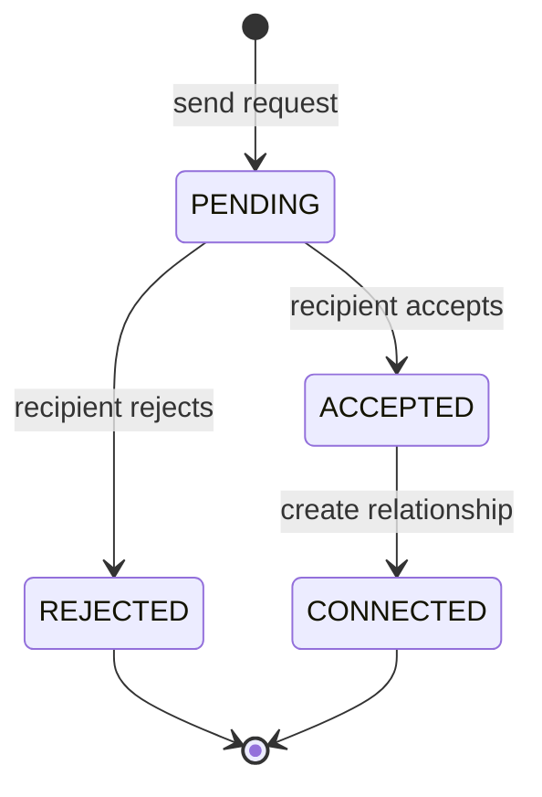
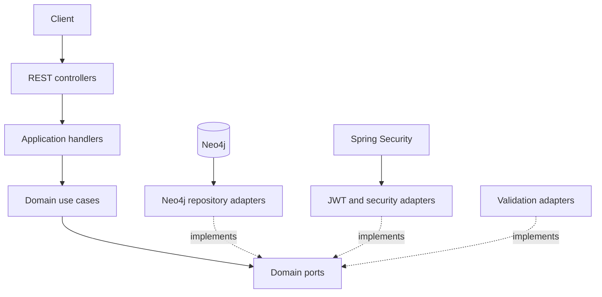

# Vinculo

> A Java/Spring social-network backend for exploring graph-native relationship modeling and connection workflows with Neo4j.

[](https://openjdk.org/)
[](https://spring.io/projects/spring-boot)
[](https://neo4j.com/)
[](https://testcontainers.com/)

Vinculo models people, connection requests, accepted relationships, posts, and feeds directly in Neo4j. The project is a portfolio system for studying graph-shaped domains, stateful workflows, and ports-and-adapters organization.

It is not presented as a proven high-scale production platform. No claim is made about millions of users, constant-time traversal, or sub-millisecond latency because those outcomes have not been benchmarked.

## Problem, decision, result

### Problem

Social relationships are naturally expressed as nodes and edges. A purely relational implementation can represent the same data, but relationship traversal and graph-oriented features tend to require join tables, recursive queries, and extra translation between the domain model and persistence model.

### Decision

Use Neo4j as the primary persistence model for social relationships:

- people are nodes;
- connection requests have an explicit lifecycle;
- accepted requests create bidirectional relationship semantics;
- connection categories and weights are modeled as domain data;
- posts and feed queries traverse the social graph;
- persistence remains behind domain ports.

### Result

The backend supports profile management, authentication, connection requests, accepted relationships, posts, personal feeds, and graph-oriented network responses while keeping application rules separate from Neo4j adapters.

## Core domain flow



The request workflow prevents a connection from appearing before the recipient has accepted it.

## Architecture



### Layer responsibilities

| Layer | Responsibility |
|---|---|
| presentation/application adapters | HTTP requests, DTOs, handlers, mapping |
| domain | models, commands, use cases, policies, ports, exceptions |
| infrastructure | Neo4j persistence, JWT, password encoding, validation |

The goal is not to apply architecture labels for their own sake. The boundary allows graph persistence and security details to change without moving those concerns into connection and post rules.

## Modules

| Module | Responsibility |
|---|---|
| `auth` | registration, login, token issuance |
| `person` | profile lifecycle and user roles |
| `request_connection` | pending, accepted, and rejected request workflow |
| `connection` | accepted relationship semantics and categories |
| `post` | post creation, ownership, deletion, and feed retrieval |
| `graph` | network-oriented response models and traversal queries |

## Relationship model

The project defines multiple relationship categories with weights. These weights are domain attributes that can support later ranking or visualization experiments; they are not currently presented as a validated recommendation metric.

Representative categories include family, partner, friend, colleague, mentor, referral, business partner, buddy, and acquaintance.

Accepted connections are treated as symmetric social relationships even when the underlying storage requires directional edges or explicit query handling.

## Main capabilities

### Authentication and authorization

- user registration and login;
- JWT-based stateless authentication;
- BCrypt password hashing;
- role-based access control;
- ownership checks for protected operations.

### Profiles

- create, read, update, and delete profile data;
- validate email and phone input;
- paginate profile queries;
- preserve administrative boundaries.

### Connection requests

- send a request to another person;
- list pending requests;
- accept or reject a request;
- prevent invalid lifecycle transitions;
- create accepted relationship state only after approval.

### Posts and feeds

- publish text posts;
- list posts by profile;
- build a feed from connected people;
- restrict deletion to the post owner;
- paginate result sets.

### Graph responses

- return nodes and relationships for visualization;
- inspect a person's network structure;
- expose graph-shaped data without claiming benchmarked scale.

## API shape

The repository includes SpringDoc/OpenAPI support for interactive inspection. Representative resource groups are:

```text
/auth
/persons
/connection-requests
/connections
/posts
/graph
```

Use the generated Swagger UI in the local environment for the current endpoint contract rather than relying on a static endpoint list in this README.

## Verification

The project uses:

- JUnit 5;
- Spring Boot Test;
- MockMvc;
- Testcontainers with Neo4j for integration behavior.

Run the suite:

```bash
./mvnw test
```

Windows:

```powershell
.\mvnw.cmd test
```

The strongest evidence to add next is a current consolidated test count and a documented set of integration scenarios for request transitions, relationship creation, feed traversal, and authorization.

## Running locally

### Requirements

- Java 21
- Docker and Docker Compose
- Maven wrapper included in the repository

Start infrastructure and application through the repository's Docker Compose configuration:

```bash
docker compose up --build
```

Or run Neo4j separately and start the application:

```bash
./mvnw spring-boot:run
```

Keep credentials and JWT secrets in environment variables or local configuration excluded from version control.

## Design decisions

| Decision | Trade-off |
|---|---|
| Neo4j as primary relationship store | Natural graph model, but adds a specialized database and Cypher-specific operational knowledge |
| Explicit request state machine | Prevents accidental connection creation, but requires transition validation and duplicate-request handling |
| Ports around persistence | Keeps domain behavior testable, while adding adapter and mapping code |
| Weighted relationship categories | Preserves domain semantics for later ranking experiments, but weights have no validated predictive meaning yet |
| JWT stateless authentication | Simplifies API scaling and separation, while requiring careful revocation and expiration strategy |

## Known limitations

- No published load test or traversal benchmark.
- No evidence supporting claims about millions of users or sub-millisecond queries.
- Relationship weights are domain configuration, not a trained or evaluated ranking model.
- Production concerns such as secret management, backups, migrations, monitoring, abuse prevention, and rate limiting require further work.
- Feed relevance is graph-based and functional, not evaluated as a recommendation system.

## Roadmap

1. consolidate and publish current test evidence;
2. add duplicate-request and concurrent-acceptance scenarios;
3. benchmark representative graph traversals with documented dataset sizes;
4. add schema constraints and migration documentation;
5. instrument query latency and error metrics;
6. document authorization and abuse cases;
7. create a small frontend visualization demo.

## STAR summary

**Situation:** connection workflows and social traversal were awkward to communicate as generic CRUD.  
**Task:** model relationship state and graph queries directly while preserving testable domain rules.  
**Action:** used Neo4j behind ports, implemented a request state machine, modeled accepted social relationships, and separated posts, feeds, auth, and graph adapters.  
**Result:** delivered a functional graph-backed social backend without relying on unverified scale claims.

## Author

Built by [Lucas Eckert](https://lucas-eckert.vercel.app).
