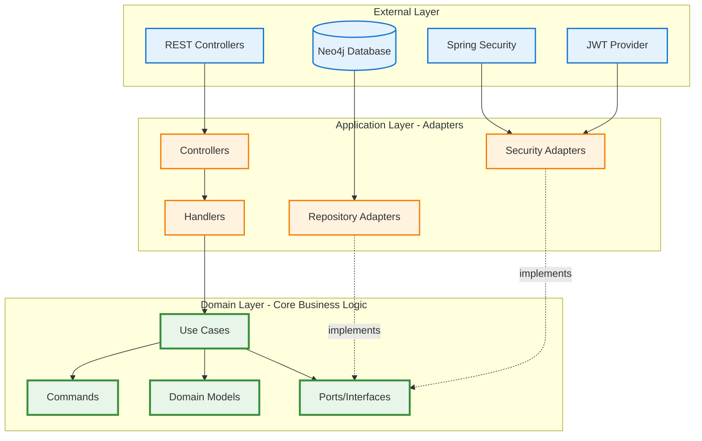
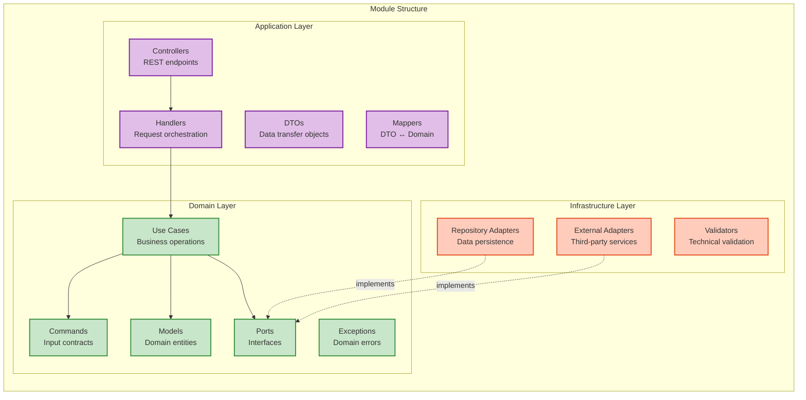
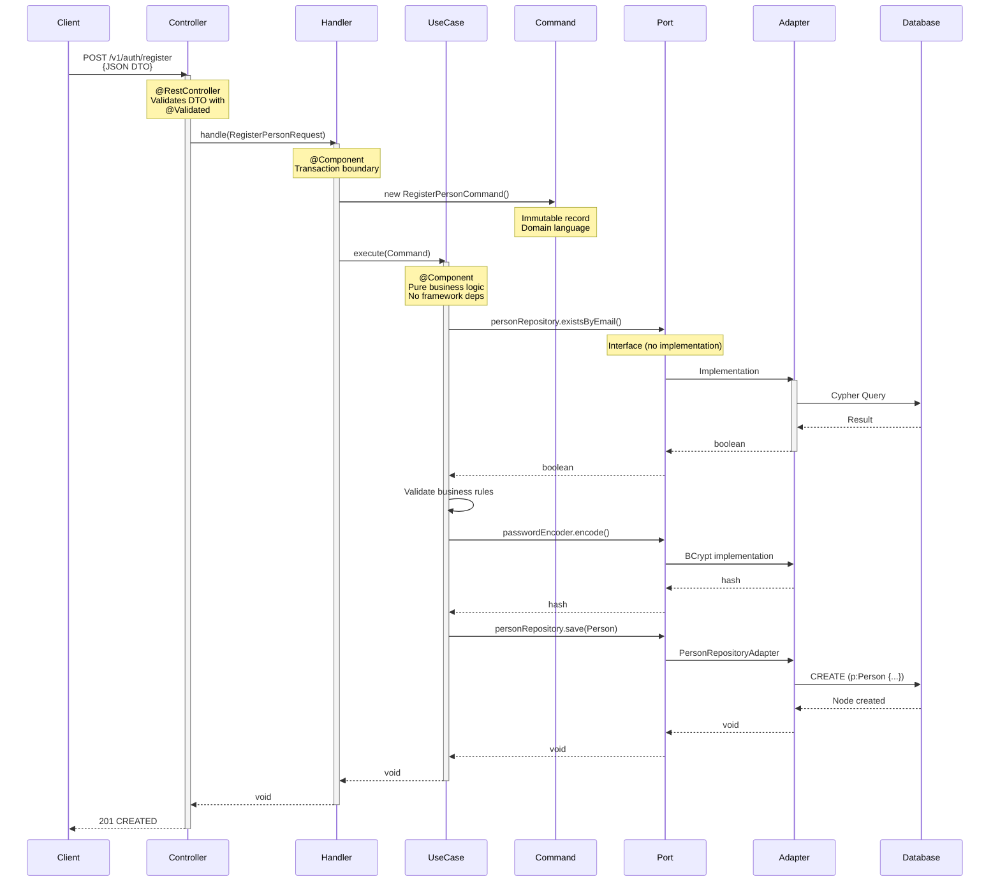
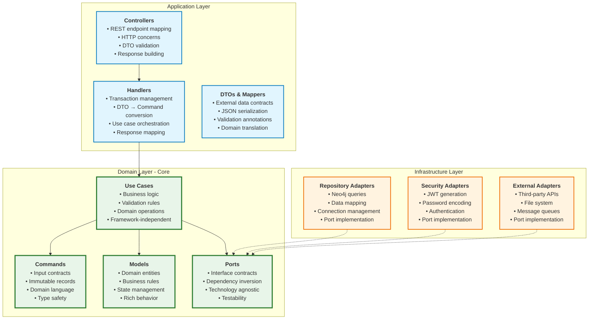
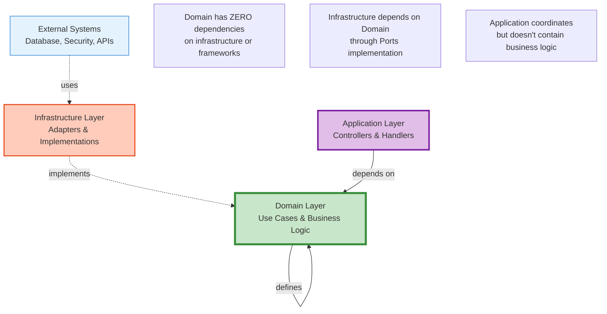
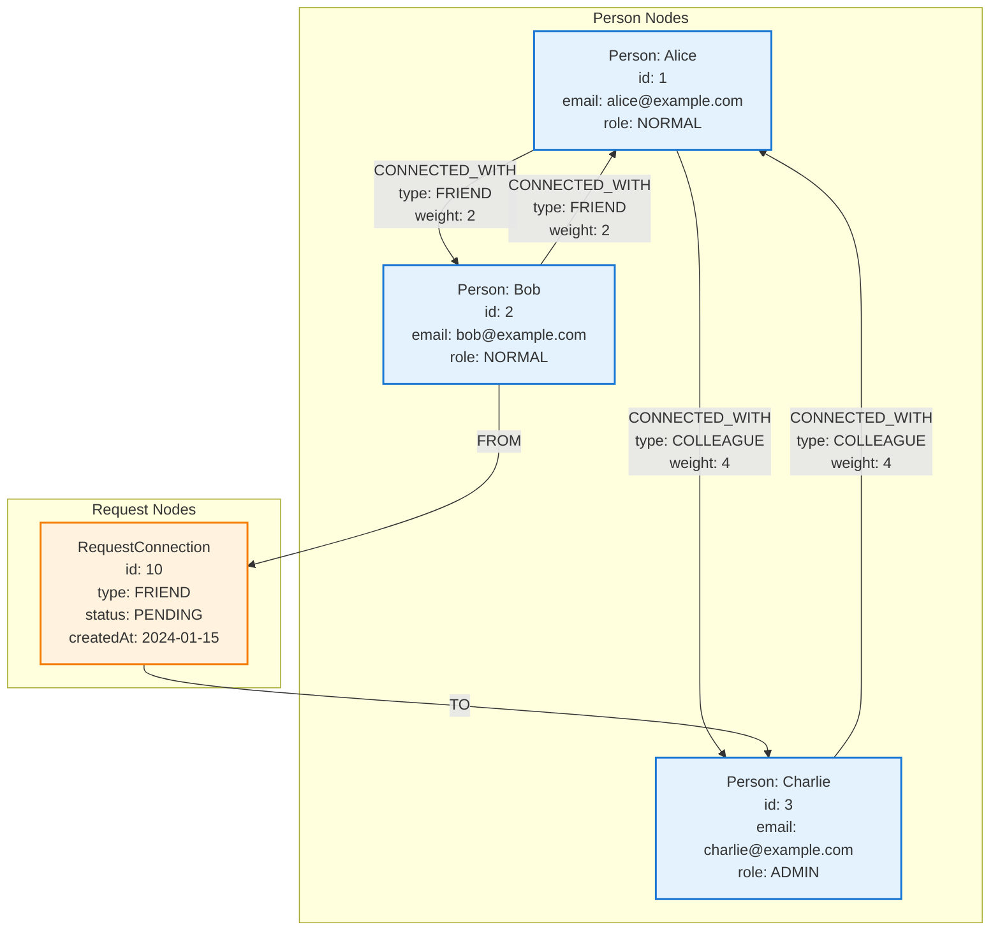

# Vinculo

> A graph-based social network platform for managing relationships using Neo4j

[](https://www.oracle.com/java/)
[](https://spring.io/projects/spring-boot)
[](https://neo4j.com/)

## 📑 Table of Contents

- [Overview](#-overview)
- [Features](#-features)
- [Technology Stack](#-technology-stack)
- [Architecture](#-architecture)
  - [Hexagonal Architecture Overview](#hexagonal-architecture-overview)
  - [DDD Module Structure](#ddd-module-structure)
  - [Request Flow](#request-flow-controller--handler--use-case--command)
  - [Layer Responsibilities](#layer-responsibilities)
  - [Dependency Flow](#dependency-flow)
- [Prerequisites](#-prerequisites)
- [Getting Started](#-getting-started)
- [API Documentation](#-api-documentation)
- [Database Schema](#-database-schema)
- [Security](#-security)
- [Development](#-development)
- [Contributing](#-contributing)

## 🎯 Overview

**Vinculo** (Portuguese for "bond" or "connection") is a social network platform built with Spring Boot and Neo4j graph database. The project demonstrates how to model social relationships using graph database technology, implementing features like connection requests, user management, and JWT-based authentication.

### What is Vinculo?

Vinculo allows users to:
- Create and manage personal profiles
- Send and receive connection requests
- Build a network of categorized connections (friends, colleagues, family, etc.)
- Publish and view posts on their feed and on other users' profiles
- Manage relationships stored natively in a graph database

### Why Graph Database?

Traditional relational databases use JOIN operations to query relationships, which becomes inefficient for social networks. Neo4j stores relationships as first-class citizens, making queries like "find all my connections" or "find connections of my connections" extremely fast, regardless of network size.

## ✨ Features

### Authentication & Authorization
- User registration and login
- JWT-based authentication
- Role-based access control (ADMIN, NORMAL)
- Secure password hashing with BCrypt

### User Management
- Create and update user profiles
- Email and phone number validation
- Admin capabilities for user management
- Paginated user listing

### Connection System
- Send connection requests to other users
- Accept or reject connection requests
- View your connections
- 9 connection types: PARTNER, FAMILY, FRIEND, BUSINESS_PARTNER, MENTOR, REFERRAL, COLLEAGUE, BUDDY, ACQUAINTANCE
- Weighted relationships (tier 1-5 based on connection type)
- Bidirectional connections (when a request is accepted, both users are connected)

### Posts
- Create text posts visible to other users
- View your own feed (posts from all connections)
- Browse posts by a specific user's profile
- Delete your own posts
- Paginated listing with configurable skip/limit

### Connection Request Workflow
1. User A sends a connection request to User B (status: PENDING)
2. User B can view incoming requests
3. User B accepts or rejects the request
4. If accepted, a bidirectional CONNECTED_WITH relationship is created
5. If rejected, the request is marked as REJECTED

## 🛠️ Technology Stack

- **Framework**: Spring Boot 4.0.2
- **Language**: Java 21
- **Database**: Neo4j 5 (Graph Database)
- **Security**: Spring Security with JWT
- **Build Tool**: Maven
- **Authentication**: JWT with HMAC-SHA256
- **Password Encryption**: BCrypt
- **Validation**: Jakarta Bean Validation
- **Phone Validation**: libphonenumber (Google)
- **Containerization**: Docker & Docker Compose

## 🏗️ Architecture

Vinculo follows **Clean Architecture** principles with **Hexagonal Architecture** (Ports and Adapters) and **Domain-Driven Design (DDD)** modular organization.

### Hexagonal Architecture Overview

The application is structured in concentric layers where dependencies point inward, ensuring business logic remains independent of external concerns:



### DDD Module Structure

Each business capability is organized as an independent module following Domain-Driven Design principles:



### Project Module Organization

```
src/main/java/com/vinculo/
├── module/
│   ├── auth/                    # Authentication module
│   │   ├── application/         # Controllers, DTOs, handlers
│   │   │   ├── controller/      # AuthController
│   │   │   ├── dto/             # LoginRequest, RegisterPersonRequest
│   │   │   └── handler/         # LoginHandler, RegisterPersonHandler
│   │   ├── domain/              # Business logic (Use cases, commands, ports)
│   │   │   ├── command/         # LoginCommand, RegisterPersonCommand
│   │   │   ├── port/            # AuthenticatorPort, TokenProvider
│   │   │   └── use_case/        # LoginUseCase, RegisterPersonUseCase
│   │   └── infrastructure/      # Technical implementations
│   │       └── security/        # JWT, Spring Security adapters
│   │
│   ├── person/                  # Person management module
│   │   ├── controller/          # REST controllers & handlers
│   │   │   ├── controller/      # PersonController
│   │   │   ├── dto/             # Request/Response DTOs
│   │   │   ├── handler/         # CRUD handlers
│   │   │   └── mapper/          # DTO mappers
│   │   ├── domain/              # Person business logic
│   │   │   ├── command/         # Person commands
│   │   │   ├── exception/       # Domain exceptions
│   │   │   ├── model/           # Person entity, RoleUser enum
│   │   │   ├── port/            # Repository, Encoder, Validator ports
│   │   │   └── use_case/        # CRUD use cases
│   │   └── infrastructure/      # Technical implementations
│   │       ├── encoder/         # BCrypt password encoder
│   │       ├── persistence/     # Neo4j repository
│   │       └── validator/       # Phone number validator
│   │
│   ├── connection/              # Connection management module
│   │   ├── application/         # API layer
│   │   ├── domain/              # Connection business logic
│   │   └── infrastructure/      # Neo4j persistence
│   │
│   ├── post/                    # Post module
│   │   ├── application/         # API layer (controller, DTOs, handlers, mappers)
│   │   ├── domain/              # Post business logic (use cases, model, ports)
│   │   └── infrastructure/      # Neo4j persistence
│   │
│   └── request_connection/      # Connection request module
│       ├── application/         # Request handling
│       ├── domain/              # Request workflow, strategies
│       └── infrastructure/      # Request persistence
│
└── share/                       # Shared cross-cutting concerns
    ├── exception/               # Global exception handling
    ├── security/                # Security configuration
    └── service/                 # Authentication service
```

### Request Flow: Controller → Handler → Use Case → Command

Every API request follows a consistent flow through the layers, transforming DTOs into Commands:



### Layer Responsibilities



### Dependency Flow

The architecture enforces strict dependency rules - dependencies always point inward toward the domain:



### Key Design Patterns

- **Hexagonal Architecture**: Clean separation between business logic and infrastructure
- **Domain-Driven Design**: Modular organization by business capability
- **Ports and Adapters**: Dependency inversion for testability and flexibility
- **Command Pattern**: Encapsulating use case inputs with immutable records
- **Strategy Pattern**: Handling different connection request statuses polymorphically
- **Repository Pattern**: Abstraction over data access layer
- **DTO Pattern**: Data transfer between external and domain layers
- **Handler Pattern**: Transaction and orchestration management

## 📋 Prerequisites

- **Java 21** or higher
- **Maven 3.9+**
- **Docker** and **Docker Compose** (for containerized deployment)
- **Neo4j 5** (if running without Docker)

## 🚀 Getting Started

### Option 1: Using Docker Compose (Recommended)

1. Clone the repository:
```bash
git clone https://github.com/Luca5Eckert/vinculo.git
cd vinculo
```

2. Create a `.env` file in the project root:
```env
NEO4J_USER=neo4j
NEO4J_PASSWORD=your_secure_password
NEO4J_URI=bolt://neo4j:7687
APP_PORT=8080
JWT_KEY=your_jwt_secret_key_minimum_256_bits
```

3. Start the application:
```bash
docker-compose up -d
```

The application will be available at `http://localhost:8080`
Neo4j Browser will be available at `http://localhost:7474`

### Option 2: Local Development

1. Install and start Neo4j:
```bash
# Download from https://neo4j.com/download/
# Or use Docker:
docker run -d \
  --name neo4j \
  -p 7474:7474 -p 7687:7687 \
  -e NEO4J_AUTH=neo4j/your_password \
  neo4j:5-community
```

2. Configure application:
```bash
export SPRING_NEO4J_URI=bolt://localhost:7687
export SPRING_NEO4J_AUTHENTICATION_USERNAME=neo4j
export SPRING_NEO4J_AUTHENTICATION_PASSWORD=your_password
export JWT_KEY=your_jwt_secret_key_minimum_256_bits
```

3. Build and run:
```bash
./mvnw clean package
./mvnw spring-boot:run
```

### Verify Installation

```bash
curl -s -o /dev/null -w "%{http_code}" -X POST http://localhost:8080/v1/auth/login \
  -H "Content-Type: application/json" \
  -d '{"email":"test@example.com","password":"wrong"}'
```

Expected response: `401` (server is up and responding)

## 📚 API Documentation

Base URL: `http://localhost:8080/v1`

### Authentication Endpoints

#### Register User
```http
POST /v1/auth/register
Content-Type: application/json

{
  "name": "John Doe",
  "email": "john@example.com",
  "password": "securePassword123",
  "phoneNumber": "+5511999999999"
}
```

Response: `201 Created`
```json
{
  "id": 1,
  "name": "John Doe",
  "email": "john@example.com",
  "phoneNumber": "+5511999999999",
  "role": "NORMAL"
}
```

#### Login
```http
POST /v1/auth/login
Content-Type: application/json

{
  "email": "john@example.com",
  "password": "securePassword123"
}
```

Response: `200 OK`
```json
{
  "token": "eyJhbGciOiJIUzI1NiIsInR5cCI6IkpXVCJ9..."
}
```

### Person Endpoints

All endpoints except auth require `Authorization: Bearer {token}` header.

#### Get All Persons
```http
GET /v1/persons?page=0&size=10
Authorization: Bearer {token}
```

#### Get Person by ID
```http
GET /v1/persons/{personId}
Authorization: Bearer {token}
```

#### Update Person
```http
PUT /v1/persons/{personId}
Authorization: Bearer {token}
Content-Type: application/json

{
  "name": "John Updated",
  "phoneNumber": "+5511988888888"
}
```

#### Delete Person (Admin only)
```http
DELETE /v1/persons/{personId}
Authorization: Bearer {token}
```

### Connection Request Endpoints

#### Send Connection Request
```http
POST /v1/request-connections/{targetPersonId}
Authorization: Bearer {token}
Content-Type: application/json

{
  "type": "FRIEND"
}
```

Connection types: `PARTNER`, `FAMILY`, `FRIEND`, `BUSINESS_PARTNER`, `MENTOR`, `REFERRAL`, `COLLEAGUE`, `BUDDY`, `ACQUAINTANCE`

#### Accept/Reject Connection Request
```http
PUT /v1/request-connections/{requestId}
Authorization: Bearer {token}
Content-Type: application/json

{
  "status": "ACCEPTED"
}
```

Status values: `ACCEPTED`, `REJECTED`

#### Get My Connection Requests
```http
GET /v1/request-connections/me
Authorization: Bearer {token}
```

Returns both incoming and outgoing requests.

### Connection Endpoints

#### Get My Connections
```http
GET /v1/connections/me
Authorization: Bearer {token}
```

Returns all established connections for the authenticated user.

### Post Endpoints

#### Create Post
```http
POST /v1/posts
Authorization: Bearer {token}
Content-Type: application/json

{
  "content": "Hello, Vinculo!"
}
```

Response: `201 Created`
```json
{
  "id": 42,
  "content": "Hello, Vinculo!",
  "createdAt": "2024-01-15T10:30:00",
  "authorId": 1
}
```

#### Get My Feed
```http
GET /v1/posts?skip=0&limit=10
Authorization: Bearer {token}
```

Returns posts visible to the authenticated user.

#### Get Posts by Author
```http
GET /v1/posts/{authorId}?skip=0&limit=10
Authorization: Bearer {token}
```

Returns all posts published by a specific user.

#### Delete Post
```http
DELETE /v1/posts/{postId}
Authorization: Bearer {token}
```

Response: `204 No Content`. Only the post owner can delete their own posts.

## 🗂️ Database Schema

### Neo4j Graph Model

```
Person Node:
- id: Long
- name: String
- email: String (unique)
- password: String (BCrypt hashed)
- phoneNumber: String (E.164 format)
- role: String (ADMIN | NORMAL)

RequestConnection Node:
- id: Long
- type: String (connection type)
- status: String (PENDING | ACCEPTED | REJECTED)
- createdAt: DateTime

Post Node:
- id: Long
- content: String
- createdAt: DateTime

Relationships:
- Person -[FROM]-> RequestConnection -[TO]-> Person
  (represents a connection request)

- Person -[CONNECTED_WITH {type, weight}]-> Person
  (bidirectional, created when request is accepted)

- Person -[AUTHORED]-> Post
  (person is the author of the post)
```

### Connection Types and Weights

| Type | Weight | Tier | Description |
|------|--------|------|-------------|
| PARTNER | 1 | 1 | Life/romantic partner |
| FAMILY | 1 | 1 | Family member |
| FRIEND | 2 | 2 | Close friend |
| BUSINESS_PARTNER | 2 | 2 | Business partner |
| MENTOR | 3 | 3 | Mentor/mentee |
| REFERRAL | 3 | 3 | Professional referral |
| COLLEAGUE | 4 | 4 | Work colleague |
| BUDDY | 4 | 4 | Casual friend |
| ACQUAINTANCE | 5 | 5 | Acquaintance |

Lower weight indicates closer relationship.

### Graph Database Visual Model



## 🔒 Security

### Authentication
- **JWT Tokens**: HMAC-SHA256 algorithm
- **Token Expiration**: 1 hour (configurable)
- **Token Claims**: email (subject), user_id, roles
- **Stateless**: No server-side session storage

### Password Security
- **BCrypt**: Adaptive hashing algorithm
- **Salt**: Automatically generated per password
- **Work Factor**: Configurable strength

### Authorization
- **Role-Based Access Control (RBAC)**
  - `NORMAL`: Standard user permissions
  - `ADMIN`: Full system access including user deletion
- **Method-level security**: `@PreAuthorize` annotations
- **Resource ownership**: Users can only modify their own data

### Security Best Practices

✅ Implemented:
- Password hashing (BCrypt)
- JWT authentication
- Input validation
- Parameterized database queries
- CORS configuration
- Environment-based secrets

⚠️ Production Recommendations:
- Use HTTPS/TLS in production
- Implement rate limiting
- Use a secrets management system (not .env files)
- Configure proper CORS origins
- Set up monitoring and audit logs
- Keep dependencies updated
- Use a strong JWT secret key (256+ bits)

## 🧪 Development

### Build the Project
```bash
./mvnw clean install
```

### Run Tests
```bash
./mvnw test
```

### Run the Application
```bash
./mvnw spring-boot:run
```

### Code Style
- Java naming conventions
- Lombok annotations for reducing boilerplate
- Clean Code principles
- Comprehensive exception handling

## 🤝 Contributing

Contributions are welcome! Please follow these steps:

1. Fork the repository
2. Create a feature branch: `git checkout -b feature/my-feature`
3. Commit your changes: `git commit -m 'Add my feature'`
4. Push to the branch: `git push origin feature/my-feature`
5. Open a Pull Request

### Guidelines
- Follow existing code style
- Write meaningful commit messages
- Add tests for new features
- Update documentation as needed
- Ensure all tests pass before submitting

## 📝 License

This project is licensed under the MIT License - see the [LICENSE](LICENSE) file for details.

## 👨‍💻 Author

**Luca Eckert**
- GitHub: [@Luca5Eckert](https://github.com/Luca5Eckert)

## 🙏 Acknowledgments

- Spring Boot for the excellent framework
- Neo4j for powerful graph database technology
- The open-source community

---

<div align="center">

**Built with Spring Boot and Neo4j**

</div>
