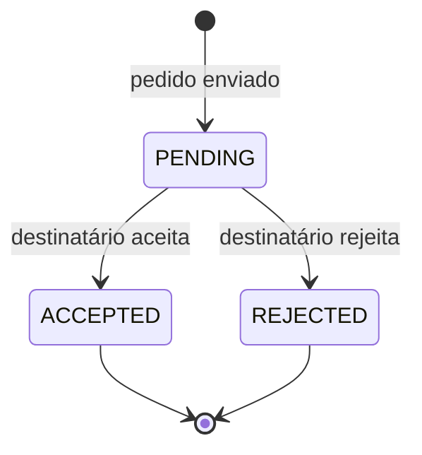
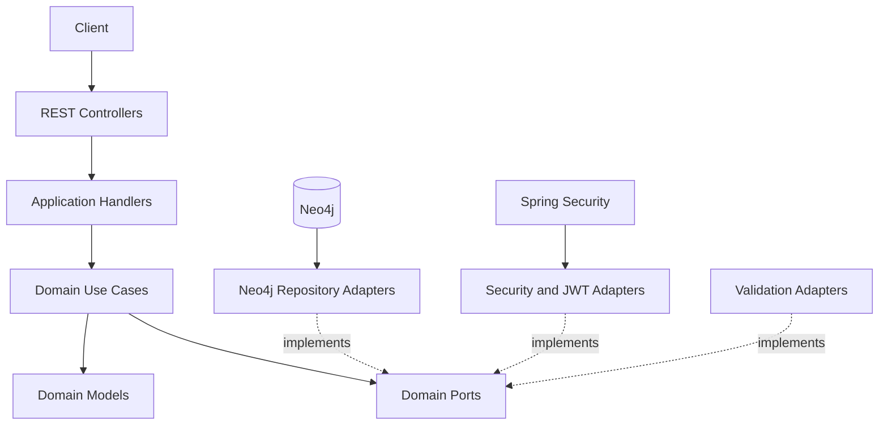
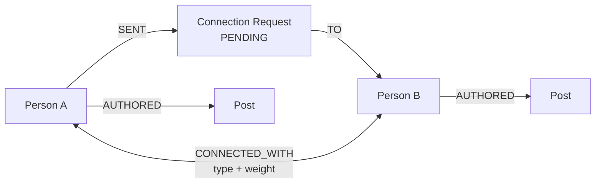

# Vínculo

> Backend de rede social usado para explorar modelagem de relacionamentos, workflows de conexão e persistência em grafo com Neo4j.

[](https://openjdk.org/)
[](https://spring.io/projects/spring-boot)
[](https://neo4j.com/)
[](https://testcontainers.com/)

Vínculo é um backend de rede social em que conexões aceitas são representadas como relacionamentos do domínio, e não apenas como linhas em uma tabela de associação.

O projeto implementa:

- cadastro e autenticação;
- perfis de usuário;
- pedidos de conexão;
- transições `PENDING`, `ACCEPTED` e `REJECTED`;
- nove categorias ponderadas de relacionamento;
- conexões bidirecionais após aceitação;
- publicação de posts;
- feed de pessoas conectadas;
- visualização do grafo social.

Este repositório é um projeto de estudo aplicado. Ele não declara escala de produção, milhões de usuários, latência submilissegundo ou complexidade constante para travessias.

## Problema, decisão e resultado

### Problema

Redes sociais possuem regras que são naturalmente relacionais:

- uma pessoa solicita conexão com outra;
- a solicitação possui estado próprio;
- a aceitação cria um vínculo navegável;
- posts devem ser recuperados a partir da rede da pessoa;
- o sistema precisa diferenciar o pedido pendente da conexão efetiva.

Forçar todos esses comportamentos em tabelas de junção e consultas recursivas pode esconder a semântica do domínio atrás da modelagem relacional.

### Decisão

- Usar Neo4j como banco principal do backend.
- Modelar pedidos de conexão como entidades com estado.
- Criar relacionamentos de conexão somente após a aceitação.
- Representar categorias e pesos de relacionamento explicitamente.
- Isolar persistência, segurança e validações atrás de portas e adaptadores.
- Validar comportamento de persistência contra instâncias reais de Neo4j com Testcontainers.

### Resultado

O backend implementa o ciclo completo:

```text
perfil -> enviar pedido -> aceitar/rejeitar -> criar conexão -> publicar conteúdo -> consultar feed/grafo
```

A principal evidência do projeto é a correspondência entre regra de domínio e estrutura do grafo, não uma alegação de desempenho em escala.

## Modelo de domínio

### Pedido de conexão



O pedido pendente continua sendo um objeto diferente da conexão aceita. Essa separação evita tratar uma intenção ainda não confirmada como vínculo social ativo.

### Conexão aceita

Quando o pedido é aceito:

1. o sistema valida remetente, destinatário e estado atual;
2. o pedido muda para `ACCEPTED`;
3. relacionamentos de conexão são criados entre os perfis;
4. o vínculo passa a participar de consultas de rede e feed.

### Categorias de relacionamento

O domínio inclui nove categorias:

| Grupo | Categorias |
|---|---|
| Relações próximas | `PARTNER`, `FAMILY` |
| Relações pessoais/profissionais | `FRIEND`, `BUSINESS_PARTNER` |
| Orientação e indicação | `MENTOR`, `REFERRAL` |
| Trabalho e convivência | `COLLEAGUE`, `BUDDY` |
| Relação eventual | `ACQUAINTANCE` |

Os pesos são atributos do domínio usados para representar importância relativa. O README não afirma que eles produzem ordenação de feed ou ganho de performance sem uma consulta e benchmark que comprovem isso.

## Arquitetura

O projeto organiza cada capacidade em módulos de domínio e aplica portas e adaptadores para separar regras de negócio de Spring Security, JWT e Neo4j.



### Módulos

```text
src/main/java/com/vinculo/module/
├── auth/                  # login, token e autenticação
├── person/                # perfil e administração de usuários
├── connection/            # relacionamentos aceitos
├── request_connection/    # workflow de pedidos
├── post/                  # publicação e feed
└── graph/                 # projeção da rede para visualização
```

Cada módulo mantém aplicação, domínio e infraestrutura próximos da capacidade que implementa.

## Fluxos principais

### Cadastro e autenticação

1. validar os dados de cadastro;
2. codificar a senha com BCrypt;
3. persistir o perfil;
4. autenticar credenciais;
5. emitir JWT;
6. aplicar autorização por função e por propriedade do recurso.

### Envio de pedido

1. o usuário autenticado escolhe outro perfil;
2. o sistema bloqueia auto-conexão e duplicidade incompatível;
3. cria um pedido `PENDING`;
4. o pedido aguarda decisão do destinatário.

### Aceitação

1. somente o destinatário elegível pode decidir;
2. o caso de uso valida que o pedido está `PENDING`;
3. o pedido muda para `ACCEPTED`;
4. o adaptador Neo4j cria a conexão efetiva;
5. o relacionamento passa a aparecer nas consultas de rede.

### Posts e feed

- usuários publicam conteúdo associado ao próprio perfil;
- exclusão respeita propriedade do post;
- o feed recupera conteúdo de pessoas conectadas;
- paginação limita o volume retornado;
- o grafo de conexões pode ser exportado como nós e arestas para visualização.

## API

O projeto usa SpringDoc/OpenAPI e Swagger UI para documentação interativa quando a aplicação está em execução.

Áreas de API:

| Área | Exemplos de responsabilidade |
|---|---|
| Auth | registro e login |
| Person | consultar, atualizar e administrar perfis |
| Request connection | enviar, listar, aceitar e rejeitar pedidos |
| Connection | consultar e remover vínculos aceitos |
| Post | criar, listar e excluir publicações |
| Graph | retornar nós e arestas da rede |

Os caminhos exatos devem ser consultados no Swagger da versão em execução, evitando que este README duplique um contrato que pode evoluir.

## Segurança

- autenticação stateless com JWT;
- senhas codificadas com BCrypt;
- funções administrativas e de usuário normal;
- segurança em nível de método onde aplicável;
- validação de propriedade para ações como exclusão de conteúdo;
- validação de telefone por adaptador externo, mantendo a regra fora do núcleo do domínio.

## Persistência em Neo4j

A modelagem usa nós para perfis, pedidos e conteúdo, e relacionamentos para vínculos aceitos.

Exemplo conceitual:



O desenho prioriza legibilidade do domínio. Ele não elimina a necessidade de índices, limites de travessia, paginação e medição para cargas maiores.

## Testes

O projeto usa:

- JUnit 5 para regras de domínio e casos de uso;
- Mockito para portas e dependências isoladas;
- MockMvc/Spring Boot Test para contratos HTTP;
- Testcontainers com Neo4j para validar mapeamentos e consultas reais.

Testcontainers é especialmente importante porque mocks não verificam Cypher, constraints, direção de relacionamentos ou comportamento do driver.

Execute:

```bash
./mvnw test
```

O README não publica uma porcentagem de cobertura ou contagem consolidada sem uma evidência atual gerada pela suíte.

## Executando localmente

### Pré-requisitos

- Java 21
- Docker e Docker Compose
- Maven Wrapper do repositório

### Subir o Neo4j

```bash
docker compose up -d
```

### Executar a aplicação

```bash
./mvnw spring-boot:run
```

### Verificar

- consulte o health check configurado pela aplicação;
- abra o Swagger UI;
- crie dois usuários;
- envie e aceite um pedido;
- confirme a criação da conexão no Neo4j Browser;
- publique posts e consulte o feed.

As credenciais e URLs devem ser configuradas pelos arquivos de exemplo do repositório. Segredos reais não devem ser versionados.

## Decisões e trade-offs

| Decisão | Benefício | Custo |
|---|---|---|
| Neo4j como persistência principal | Relações aceitas permanecem explícitas e navegáveis | Exige Cypher, modelagem de direção e operação de uma tecnologia menos comum que SQL |
| Pedido separado da conexão | Representa intenção e vínculo como estados diferentes | Adiciona entidade e transições a serem mantidas |
| Conexão bidirecional explícita | Simplifica algumas consultas de vizinhança | Requer consistência ao criar/remover os dois sentidos |
| Portas e adaptadores | Mantém regras isoladas de Spring e Neo4j | Aumenta o número de abstrações e mapeamentos |
| Testcontainers | Valida consultas reais e integração com Neo4j | Torna parte da suíte mais lenta e dependente de Docker |
| JWT stateless | Evita sessão no servidor | Revogação e rotação precisam de estratégia própria |

## Limitações conhecidas

- Não existe benchmark público de carga, latência ou tamanho de grafo.
- Não há evidência para afirmar suporte a milhões de usuários ou consultas submilissegundo.
- Travessias dependem do padrão consultado, cardinalidade, profundidade, índices e volume de resultados.
- A estratégia de conexões em dois sentidos precisa de proteção transacional e testes de consistência.
- O feed implementado é funcional, mas não representa um sistema de ranking em larga escala.
- O projeto não declara implantação comercial ou tráfego de produção.
- Estratégias de moderação, privacidade avançada, bloqueio, denúncia e exclusão de conta ainda não representam um produto social completo.

## Próximos passos

1. adicionar uma suíte de benchmark reproduzível com tamanhos de grafo conhecidos;
2. documentar índices e constraints do Neo4j;
3. medir consultas de conexão, feed e visualização em p50/p95;
4. adicionar bloqueio, privacidade e remoção segura de relacionamentos;
5. proteger operações bidirecionais contra estados parciais;
6. criar testes de autorização por recurso;
7. adicionar observabilidade para consultas Cypher e erros de domínio;
8. documentar migrações/evolução do modelo de grafo.

## O que este projeto demonstra

- modelagem de estado com transições explícitas;
- uso de grafo como parte do domínio, não como slogan de performance;
- separação entre pedido e relacionamento aceito;
- arquitetura hexagonal em módulos de negócio;
- autenticação e autorização em Spring;
- testes reais de persistência com Neo4j Testcontainers.

## Autor

Construído e mantido por [Lucas Eckert](https://github.com/Luca5Eckert).
